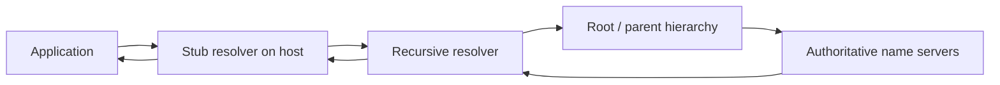
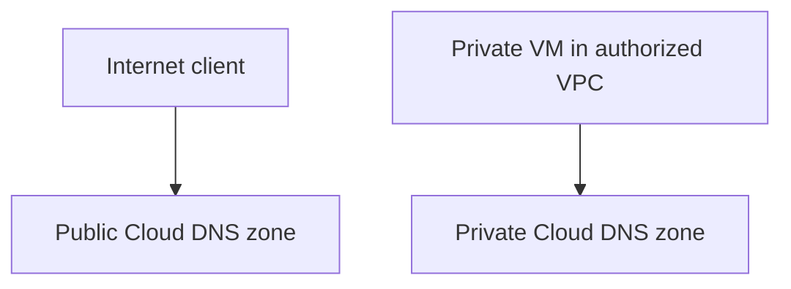
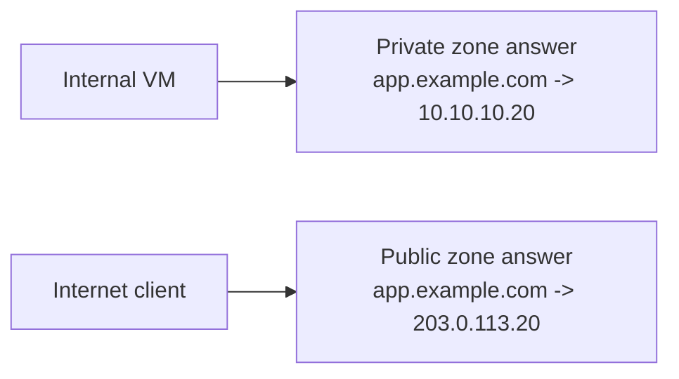
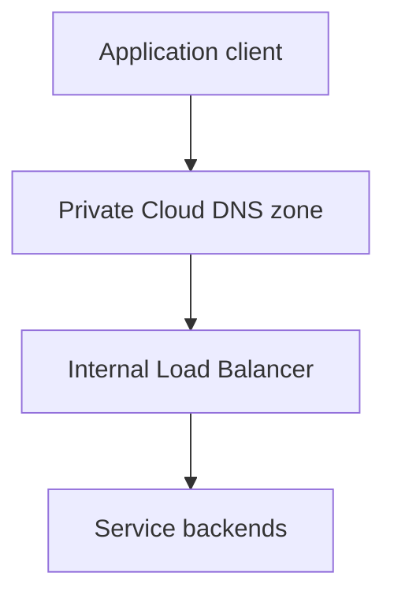
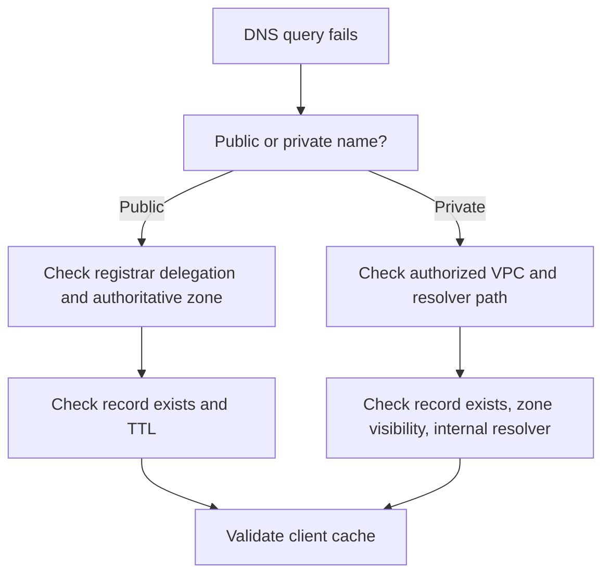

## DNS fundamentals

DNS is the system that turns names into answers. Most often, that means turning a hostname into an IP address, but DNS also stores mail routing, service discovery, verification records, and many other pieces of metadata.

For cloud engineers, the important point is this: **DNS is not just naming, it is traffic steering**.

When a workload connects to `api.example.com`, DNS can determine whether the client reaches:

- a public load balancer
- a private internal load balancer
- a regional service endpoint
- a failover site
- a development or production environment

### The three layers to remember

| Layer | What it does | Example |
| --- | --- | --- |
| Stub resolver | Lives on the client VM, pod, or laptop | `getaddrinfo()` on Linux |
| Recursive resolver | Looks up the answer on behalf of the client and caches it | corporate DNS or VPC-provided resolver |
| Authoritative DNS | Owns the final answer for a zone | Cloud DNS public or private zone |

### Resolution flow



### Common record types

| Record type | What it means | Common cloud use |
| --- | --- | --- |
| `A` | Name to IPv4 address | Public website, internal service |
| `AAAA` | Name to IPv6 address | Dual-stack services |
| `CNAME` | Alias to another hostname | App alias to load balancer hostname |
| `MX` | Mail routing | Email platforms |
| `TXT` | Arbitrary text metadata | SPF, DKIM, verification |
| `SRV` | Service endpoint and port | Internal service discovery |
| `PTR` | Reverse lookup | Audit and troubleshooting |

### TTL and propagation

TTL, or time to live, tells recursive resolvers how long they can cache an answer.

That leads to a practical rule:

- **record updates in the authoritative zone can be immediate**
- **client-visible change can still lag because recursive resolvers cache the old answer until TTL expires**

This is why DNS changes often feel inconsistent during rollouts. Two clients can see different answers at the same time because their resolvers cached different versions at different times.

## Cloud DNS overview

Cloud DNS is Google's managed authoritative DNS service.

At a high level, it gives you:

- public DNS zones for internet-visible names
- private DNS zones for names visible only inside selected VPC networks
- forwarding and peering capabilities for more advanced private resolution patterns
- project-level and zone-level IAM integration

Cloud DNS is authoritative DNS, not a recursive caching service you manage directly. It publishes and serves zone data. Clients still rely on recursive resolvers to query that authoritative data.

### Why Cloud DNS matters in real environments

For cloud engineers, Cloud DNS usually becomes the control point for:

- public application names such as `www.example.com`
- internal names such as `orders.prod.internal.example`
- private access to shared services across VPCs
- naming consistency in Shared VPC and hybrid environments

### Cloud DNS zone types you will see most

| Zone type | Visibility | Common use |
| --- | --- | --- |
| Public managed zone | Public internet | Website, public API, email records |
| Private managed zone | Selected VPC networks only | Internal services, private load balancers |
| Forwarding zone | Private, forwards to other DNS servers | Hybrid/on-prem DNS integration |
| Peering zone | Private, sends lookups to another VPC network's name resolution path | DNS sharing across VPCs |

### Cloud DNS in one picture



### Console and CLI mental model

In the console, you usually work in:

- **Network services > Cloud DNS**

In `gcloud`, the main command group is:

```bash
gcloud dns
```

## Public vs private zones

The most important Cloud DNS choice is whether the zone should be public or private.

### Public zones

A public zone is visible on the public internet. Use it when an external client must resolve the name.

Good examples:

- `www.example.com`
- `api.example.com`
- `mail.example.com`

### Private zones

A private zone is visible only to the VPC networks that you authorize.

Good examples:

- `db.prod.internal.example`
- `orders.service.corp`
- `redis.shared.internal`

### Practical comparison

| Question | Public zone | Private zone |
| --- | --- | --- |
| Who can resolve it? | Anyone on the internet through recursive resolvers | Only authorized VPC networks |
| Good for public apps? | Yes | No |
| Good for internal-only services? | No | Yes |
| Common mistake | Publishing private infrastructure publicly by accident | Forgetting to authorize the right VPC network |

### Public zone `gcloud` example

```bash
gcloud dns managed-zones create prod-public-zone \
  --dns-name=example.com. \
  --description="Public DNS zone for production internet endpoints" \
  --visibility=public
```

Add an A record transactionally:

```bash
gcloud dns record-sets transaction start --zone=prod-public-zone

gcloud dns record-sets transaction add "203.0.113.20" \
  --name=www.example.com. \
  --ttl=300 \
  --type=A \
  --zone=prod-public-zone

gcloud dns record-sets transaction execute --zone=prod-public-zone
```

### Private zone `gcloud` example

```bash
gcloud dns managed-zones create prod-private-zone \
  --dns-name=prod.internal.example. \
  --description="Private DNS zone for production services" \
  --visibility=private \
  --networks=prod-core-vpc
```

Add an internal record:

```bash
gcloud dns record-sets transaction start --zone=prod-private-zone

gcloud dns record-sets transaction add "10.10.20.15" \
  --name=orders.prod.internal.example. \
  --ttl=60 \
  --type=A \
  --zone=prod-private-zone

gcloud dns record-sets transaction execute --zone=prod-private-zone
```

### Terraform example

```hcl
terraform {
  required_version = ">= 1.7.0"

  required_providers {
    google = {
      source  = "hashicorp/google"
      version = "~> 7.0"
    }
  }
}

resource "google_compute_network" "prod" {
  name                    = "prod-core-vpc"
  auto_create_subnetworks = false
}

resource "google_dns_managed_zone" "public" {
  name        = "prod-public-zone"
  dns_name    = "example.com."
  description = "Public zone for production internet endpoints"
}

resource "google_dns_record_set" "public_www" {
  name         = "www.${google_dns_managed_zone.public.dns_name}"
  managed_zone = google_dns_managed_zone.public.name
  type         = "A"
  ttl          = 300
  rrdatas      = ["203.0.113.20"]
}

resource "google_dns_managed_zone" "private" {
  name        = "prod-private-zone"
  dns_name    = "prod.internal.example."
  description = "Private zone for production internal services"
  visibility  = "private"

  private_visibility_config {
    networks {
      network_url = google_compute_network.prod.id
    }
  }
}

resource "google_dns_record_set" "orders_internal" {
  name         = "orders.${google_dns_managed_zone.private.dns_name}"
  managed_zone = google_dns_managed_zone.private.name
  type         = "A"
  ttl          = 60
  rrdatas      = ["10.10.20.15"]
}
```

## Split-horizon DNS

Split-horizon DNS means returning different answers for the same name depending on where the query comes from.

The common pattern is:

- public users resolve `app.example.com` to a public load balancer
- internal workloads resolve `app.example.com` to a private or internal address

### Split-horizon example



### Why engineers use it

Split-horizon is useful when you want:

- the same hostname for internal and external users
- private east-west traffic to stay private
- public clients to use public ingress while internal clients avoid internet egress

### Practical pattern

| Query source | Zone consulted | Answer |
| --- | --- | --- |
| VM in authorized VPC | Private zone | `10.10.10.20` |
| Laptop on internet | Public zone | `203.0.113.20` |

### Important behavior

Cloud DNS private zones can overlap with public zones. For authorized VPC networks, the private zone wins for its namespace. That is what makes split-horizon work.

### Production caution

Split-horizon is powerful, but it adds debugging complexity. When someone says "DNS is broken," the first question becomes:

- **From where is the query being made?**

If you do not clearly document the intended audience of the record, engineers will compare answers from different networks and assume something is wrong when the behavior is actually by design.

## Internal service discovery

Service discovery is the practice of making services discoverable by name instead of hardcoded IPs.

In Google Cloud, you have several practical service discovery building blocks.

### 1. Compute Engine internal DNS

Compute Engine automatically creates internal DNS names for VMs in the `.internal` namespace.

Example formats:

- zonal: `instance-1.us-central1-a.c.PROJECT_ID.internal`
- global: `instance-1.c.PROJECT_ID.internal`

Google recommends **zonal internal DNS** because it has a smaller failure domain and better reliability characteristics than project-wide global internal DNS.

### 2. Cloud DNS private zones

For custom internal names, private zones are usually the cleanest answer.

Examples:

- `orders.prod.internal.example`
- `redis.platform.internal.example`
- `grafana.shared.internal.example`

This is better than relying only on auto-generated instance names because:

- names are stable even if backend instances change
- you can point records at internal load balancers instead of single VMs
- the naming model is application-centric rather than VM-centric

### 3. Service Directory with Cloud DNS

For more structured service discovery, Google Cloud also supports **Service Directory** integration with Cloud DNS.

That is useful when:

- services have multiple endpoints
- you want DNS plus service registry semantics
- teams need structured service registration rather than manual record updates

### 4. GKE and internal names

Inside Kubernetes, service discovery is usually handled by cluster DNS. For platform-wide naming that spans GKE, VMs, and shared services, Cloud DNS private zones are often still useful at the VPC or environment boundary.

### Practical service discovery pattern



This pattern is more production-safe than pointing DNS directly at a single VM IP.

## Troubleshooting DNS

DNS troubleshooting is mostly about asking the right question in the right order.

Start with this:

1. What exact name is being queried?
2. From which network or host is it being queried?
3. Which resolver is being used?
4. Which zone should answer?
5. Is the record present there?
6. Could TTL caching still be serving an old answer?

### Common failure patterns

| Symptom | Likely cause | What to check |
| --- | --- | --- |
| Public name does not resolve | Missing zone delegation or missing record | NS records at registrar, public record set |
| Private name resolves from one VPC but not another | Wrong authorized network list | Private zone visibility configuration |
| Private VM cannot resolve internal names | Custom resolver replaced Google-provided path incorrectly | `/etc/resolv.conf`, metadata-server forwarding, DHCP config |
| Record changed but clients still see old value | TTL cache not expired | TTL value, recursive resolver cache age |
| Split-horizon seems inconsistent | Query source differs | Public versus private query path |

### Practical commands

Describe a zone:

```bash
gcloud dns managed-zones describe prod-private-zone
```

List records:

```bash
gcloud dns record-sets list --zone=prod-private-zone
```

Check public delegation and authoritative answers:

```bash
dig NS example.com
dig @ns-cloud-<zone>.googledomains.com www.example.com
dig +trace www.example.com
```

Check a private answer from a VM:

```bash
dig orders.prod.internal.example
nslookup orders.prod.internal.example
cat /etc/resolv.conf
```

### Troubleshooting flow



### Practical propagation advice

Before a planned cutover:

- lower the TTL well in advance
- make the change
- validate from multiple networks
- raise TTL later if appropriate

Dropping TTL five minutes before the cutover is often too late because many recursive resolvers already cached the old longer TTL.

## Production best practices

### 1. Use low TTLs only when the change rate justifies them

Very low TTLs help fast cutovers, but they also increase query volume and can make behavior noisier. Use them deliberately.

### 2. Prefer internal load balancers over single VM IPs

For internal service discovery, DNS names should usually point at stable front doors, not ephemeral backends.

### 3. Document split-horizon behavior

Same-name, different-answer DNS is powerful but confusing. Write down:

- which networks get private answers
- which names are split-horizon
- which teams own each side

### 4. Use private zones for private names

Do not rely on public DNS tricks to represent private infrastructure.

### 5. Keep internal DNS and custom private DNS distinct in your head

Compute Engine internal `.internal` DNS is automatic and VM-oriented. Cloud DNS private zones are custom and application-oriented.

### 6. Plan DNS for Shared VPC explicitly

In Shared VPC environments, design who owns the zone, which networks are authorized, and whether cross-project binding is needed. DNS ownership becomes an organizational issue quickly.

### 7. Treat DNS as production control plane

DNS changes can reroute real traffic instantly once caches expire. Put zone and record updates through review and version control when the names matter to production paths.

## FAQ

**What is the difference between public and private Cloud DNS zones?**  
Public zones are visible to the internet. Private zones are visible only to the VPC networks that you authorize.

**Is Cloud DNS a recursive resolver?**  
No. Cloud DNS is an authoritative DNS service. Recursive resolvers and client stub resolvers still exist in front of it.

**Why do I still see the old IP after changing a record?**  
Usually because of TTL-based caching in recursive resolvers or on the client host.

**What is split-horizon DNS in plain language?**  
It means the same hostname can return different answers depending on where the query originates.

**Should I use Compute Engine internal DNS or a private Cloud DNS zone?**  
Use internal DNS for automatic VM naming. Use private Cloud DNS zones for stable, custom, application-centric internal names.

**Does Private Google Access replace Cloud DNS private zones?**  
No. Private Google Access is about reaching Google APIs and services from private VMs. Private zones are about authoritative naming for your private namespaces.

**Can two VPCs share private DNS?**  
Yes, but the design matters. You can authorize multiple VPCs to use the same private zone, or use peering zones and other private DNS features depending on the topology.

**What is the safest DNS pattern for internal services?**  
A private DNS name that points to an internal load balancer is usually safer and more stable than pointing directly at a single VM.
