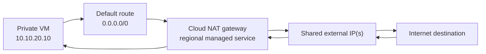
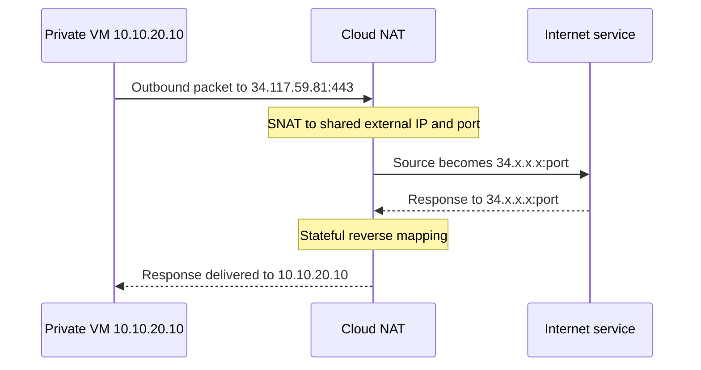
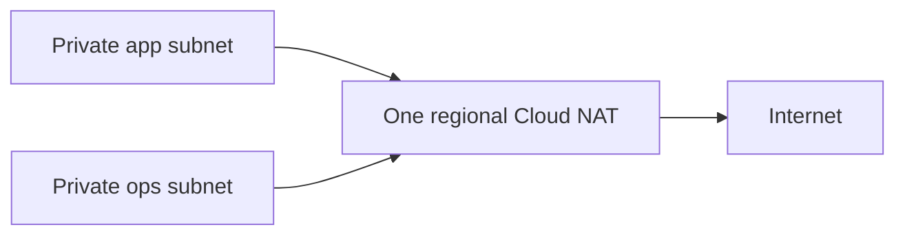
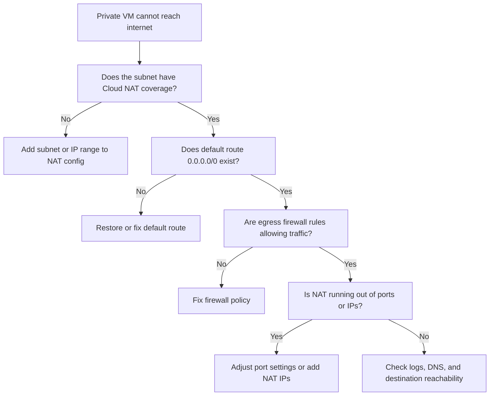

## Why Cloud NAT exists

Many workloads need outbound internet access but should not be directly reachable from the internet.

Common examples include:

- private application VMs downloading packages or container images
- GKE nodes pulling images and sending telemetry
- internal services calling public APIs
- patching, backups, and software updates

Without Cloud NAT, engineers often fall back to the wrong pattern: assigning a public IP address to every VM that needs egress. That works, but it increases the attack surface and makes outbound identity harder to control.

Cloud NAT exists to solve that problem:

- VMs can keep **private IP addresses only**
- Google Cloud provides **shared outbound NAT**
- the workloads can reach the internet
- the internet cannot start unsolicited inbound connections back to those workloads

That last point matters most. Cloud NAT supports **outbound connections and established return traffic only**. It is not a public ingress product.



Cloud NAT is also not a bastion host. A bastion is for **controlled inbound administration** such as SSH. Cloud NAT is for **outbound egress**.

## Public vs private networking

Before Cloud NAT makes sense, you need a clean model of public and private IP use in Google Cloud.

### Public IPs

A VM with an external IPv4 address can send traffic to the internet directly by using that public IP. That might be fine for:

- internet-facing load balancer backends that must expose a public service
- temporary labs
- tightly controlled bastion hosts

But in production, it creates questions you now have to solve:

- Which workloads are actually reachable from the internet?
- Are firewall rules tight enough?
- Are you comfortable exposing many public source IP identities to outside services?

### Private IPs

A VM with only an internal IP address lives entirely inside your VPC unless you provide a path out. That private-only model is usually the safer default for:

- app tiers
- worker pools
- database servers
- GKE nodes

### Bastion hosts versus Cloud NAT

These are often confused, so separate them clearly:

| Component | Purpose | Inbound from internet | Outbound to internet |
| --- | --- | --- | --- |
| Public VM | General compute with external IP | Possible, depending on firewall | Yes |
| Bastion host | Admin entry point | Yes, intentionally restricted | Usually yes |
| Private VM with Cloud NAT | Private workload egress | No unsolicited inbound | Yes |

If your goal is **SSH into private servers**, Cloud NAT is not the answer. Use one of these instead:

- Identity-Aware Proxy TCP forwarding
- a bastion host
- VPN or Interconnect from your corporate network

### Secure outbound traffic

The production-safe baseline in Google Cloud is:

- no public IPs on app, worker, or database VMs
- Cloud NAT for egress
- firewall rules that allow only the outbound traffic you actually need
- known public NAT IPs when a third party needs to allowlist your egress addresses

That gives you a smaller exposed surface without breaking internet-dependent operations.

## How Cloud NAT works

Cloud NAT is a **regional managed service**. You configure it on a **Cloud Router**, but Cloud Router is only the **control plane** for NAT. It does not act like a forwarding appliance.

The key architecture facts are:

- Cloud NAT is **distributed and software-defined**
- it does **not** depend on proxy VMs
- it serves **subnets in the same region**
- it provides **source NAT** for outbound traffic
- it allows only **established inbound response packets**

### Step-by-step packet flow

Assume:

- Subnet: `10.10.20.0/24`
- VM: `10.10.20.10`
- VM has no external IP
- Destination: `34.117.59.81`
- Cloud NAT is configured for the subnet

The flow looks like this:

1. The VM sends a packet to the destination on the internet.
2. The VPC route lookup selects the default route `0.0.0.0/0`.
3. Cloud NAT sees that the source subnet is covered by the NAT gateway.
4. Cloud NAT changes the packet source from the private IP to one of the gateway's external IPs and allocates a source port.
5. The destination sees the traffic as coming from the NAT IP, not from the VM's private IP.
6. The response comes back to that NAT IP and port.
7. Cloud NAT maps the response back to the original VM and internal source port.



### Cloud NAT does not replace routing

Cloud NAT works **with** routing, not instead of routing. Your subnet still needs:

- the default internet route to `default-internet-gateway`
- egress firewall rules that permit the traffic

If you remove the default route or block egress with firewall rules, Cloud NAT will not save the connection.

### Cloud NAT does not create inbound access

A frequent misunderstanding is:

- "The VM has NAT, so can I SSH to it from the internet?"

No. Public NAT does not allow unsolicited inbound connections. If the VM has no external IP, there is no direct public ingress path to it.

### NAT scaling and port allocation

Cloud NAT scales by combining:

- one or more NAT IP addresses
- source port allocations per VM

Each NAT IP provides a large pool of TCP and UDP source ports. Cloud NAT can use:

- **automatic NAT IP allocation** when you want Google to add regional external IPs as needed
- **manual NAT IP allocation** when you want to control exactly which public IPs are used
- **dynamic port allocation** when you want Cloud NAT to scale ports up and down per VM

Production implication:

- low, steady outbound workloads are usually fine with auto allocation and standard defaults
- bursty, high-connection workloads often need closer port planning, logging, and possibly more NAT IPs

### Cost considerations

Cloud NAT cost is not just "a gateway exists". Public NAT pricing is shaped by multiple factors:

- gateway usage
- data processed through the NAT gateway
- external IP addresses attached to the NAT gateway
- normal internet egress transfer charges

That means a design with many egress-heavy nodes can cost more than a small management subnet using NAT only for updates. Cost planning should be based on traffic profile, not just VM count.

## Creating Cloud NAT

This tutorial uses a simple production-style pattern:

- VPC: `prod-core-vpc`
- Subnet: `prod-us-central1-app-snet`
- Region: `us-central1`
- Cloud Router: `prod-us-central1-nat-cr`
- Cloud NAT gateway: `prod-us-central1-public-nat`

### What you need first

Before creating Cloud NAT, make sure you already have:

- a custom VPC
- a subnet in the same region as the NAT gateway
- VMs without external IPs in that subnet
- firewall rules that allow the required egress traffic

### gcloud example

Create the Cloud Router first:

```bash
gcloud compute routers create prod-us-central1-nat-cr \
  --network=prod-core-vpc \
  --region=us-central1
```

Then create the Cloud NAT gateway:

```bash
gcloud compute routers nats create prod-us-central1-public-nat \
  --router=prod-us-central1-nat-cr \
  --region=us-central1 \
  --auto-allocate-nat-external-ips \
  --nat-custom-subnet-ip-ranges=prod-us-central1-app-snet:ALL \
  --enable-dynamic-port-allocation \
  --enable-logging
```

What this does:

- uses a regional Cloud Router as the NAT control plane
- automatically allocates public NAT IPs
- applies NAT to all IP ranges of the app subnet
- enables dynamic port allocation
- enables NAT logging

Describe the gateway afterward:

```bash
gcloud compute routers nats describe prod-us-central1-public-nat \
  --router=prod-us-central1-nat-cr \
  --region=us-central1
```

### Terraform example

```hcl
terraform {
  required_version = ">= 1.7.0"

  required_providers {
    google = {
      source  = "hashicorp/google"
      version = "~> 7.0"
    }
  }
}

provider "google" {
  project = var.project_id
  region  = "us-central1"
}

resource "google_compute_network" "prod" {
  name                    = "prod-core-vpc"
  auto_create_subnetworks = false
}

resource "google_compute_subnetwork" "app" {
  name                     = "prod-us-central1-app-snet"
  ip_cidr_range            = "10.10.20.0/24"
  region                   = "us-central1"
  network                  = google_compute_network.prod.id
  private_ip_google_access = true
}

resource "google_compute_router" "nat" {
  name    = "prod-us-central1-nat-cr"
  region  = google_compute_subnetwork.app.region
  network = google_compute_network.prod.id

  bgp {
    asn = 64514
  }
}

resource "google_compute_router_nat" "public_nat" {
  name                               = "prod-us-central1-public-nat"
  router                             = google_compute_router.nat.name
  region                             = google_compute_router.nat.region
  nat_ip_allocate_option             = "AUTO_ONLY"
  source_subnetwork_ip_ranges_to_nat = "LIST_OF_SUBNETWORKS"
  enable_dynamic_port_allocation     = true
  min_ports_per_vm                   = 128
  max_ports_per_vm                   = 4096

  subnetwork {
    name                    = google_compute_subnetwork.app.id
    source_ip_ranges_to_nat = ["ALL_IP_RANGES"]
  }

  log_config {
    enable = true
    filter = "ERRORS_ONLY"
  }
}

variable "project_id" {
  type = string
}
```

### Manual NAT IPs for allowlisting

If an external partner needs fixed source IPs, use **manual NAT IP allocation** instead of auto allocation.

```hcl
resource "google_compute_address" "nat_ip_1" {
  name   = "prod-us-central1-nat-ip-1"
  region = "us-central1"
}

resource "google_compute_router_nat" "manual_public_nat" {
  name                               = "prod-us-central1-manual-nat"
  router                             = google_compute_router.nat.name
  region                             = google_compute_router.nat.region
  nat_ip_allocate_option             = "MANUAL_ONLY"
  nat_ips                            = [google_compute_address.nat_ip_1.self_link]
  source_subnetwork_ip_ranges_to_nat = "LIST_OF_SUBNETWORKS"

  subnetwork {
    name                    = google_compute_subnetwork.app.id
    source_ip_ranges_to_nat = ["ALL_IP_RANGES"]
  }

  log_config {
    enable = true
    filter = "ALL"
  }
}
```

Use this pattern when a SaaS vendor, payment gateway, or partner API needs to allowlist your egress IPs.

## Security best practices

Cloud NAT is a security improvement, but only if you use it with discipline.

### 1. Keep private workloads private

Do not attach public IPs to app VMs just because they need updates or API calls. That is the exact problem Cloud NAT is designed to avoid.

### 2. Separate admin access from internet egress

Use:

- Cloud NAT for outbound internet traffic
- IAP, bastions, VPN, or Interconnect for administration

Do not turn one pattern into the other.

### 3. Restrict egress intentionally

Cloud NAT gives a path out. It does not decide what should be allowed out.

Pair it with:

- explicit egress firewall rules where appropriate
- DNS and proxy controls if you need domain-based governance
- VPC Flow Logs and NAT logs for visibility

### 4. Prefer manual NAT IPs when outbound identity matters

Auto allocation is operationally easy, but manual IPs are often better when:

- external services require allowlisting
- compliance requires stable egress identities
- incident response teams want predictable source IPs

### 5. Understand Google API traffic separately

Traffic to Google APIs does not always need to follow the same internet path as general outbound web traffic. In many environments, you should also enable:

- **Private Google Access** for private subnets

That avoids treating Google API access exactly like generic internet egress.

### 6. Log what matters

Turn on NAT logging for:

- errors and dropped packets at minimum
- all translations for sensitive environments

Logging helps detect:

- port exhaustion
- unexpected egress patterns
- missing subnet coverage

## Production architectures

There is no single correct Cloud NAT design. The right pattern depends on scale, compliance, and workload shape.

### 1. Small production environment

Best for:

- one region
- one or two private subnets
- moderate outbound traffic

Pattern:

- one regional Cloud NAT gateway
- auto-allocated NAT IPs
- egress firewall rules
- optional IAP instead of bastions



### 2. Regulated environment with allowlisted egress

Best for:

- third-party allowlisting
- compliance controls
- known outbound identities

Pattern:

- manual NAT IP allocation
- documented external IP inventory
- logs enabled
- tightly scoped subnets

### 3. GKE private node egress

Best for:

- GKE nodes without external IPs
- image pulls and package downloads
- centralized egress design

Pattern:

- Cloud NAT on the node subnet
- private nodes
- monitoring for dropped packets and port exhaustion

### 4. Shared services or platform subnet design

Best for:

- multiple app teams in one region
- platform-managed egress

Pattern:

- one NAT gateway can serve multiple subnets in the same region
- route and firewall ownership stays centralized
- cost and port usage should be monitored as adoption grows

### NAT scaling guidance

Use this table as a practical starting point:

| Situation | Recommended approach |
| --- | --- |
| Light egress, few VMs | Auto NAT IP allocation is usually fine |
| High connection count per VM | Enable dynamic port allocation and monitor drops |
| Stable partner allowlists | Manual NAT IPs |
| Large GKE or autoscaled fleets | Watch per-VM port demand, add NAT IPs when needed |
| Multi-region workloads | Create NAT gateways per region, not one global NAT |

### Cost guidance

Cloud NAT cost usually scales with:

- number of instances using the gateway
- amount of data processed
- number of public NAT IPs
- total internet egress

A common production mistake is over-optimizing for "one fewer public IP" while ignoring much larger data processing and egress patterns. Measure traffic first.

## Troubleshooting outbound connectivity

When private workloads cannot reach the internet, work through the path in order.



### Common failure patterns

| Symptom | Likely cause | What to check |
| --- | --- | --- |
| VM has no internet access | NAT not attached to the subnet | NAT subnet coverage |
| Some destinations fail, others work | Firewall or DNS issue | Egress rules, name resolution |
| Bursty workloads drop packets | Port exhaustion | NAT logs and metrics |
| VM still uses its own public IP | VM has external IP attached | Instance network interface |
| Google APIs work but internet sites fail | Private Google Access works, general egress path does not | Default route, NAT coverage, firewall |

### Useful commands

```bash
gcloud compute routers nats describe prod-us-central1-public-nat \
  --router=prod-us-central1-nat-cr \
  --region=us-central1

gcloud compute routers get-nat-mapping-info prod-us-central1-nat-cr \
  --region=us-central1
```

Look for:

- which subnets the gateway covers
- whether NAT IPs were allocated
- whether mappings exist for the VM
- whether the workload is exhausting ports

Production tip: NAT logging is valuable, but it is not a packet capture. Use it with VPC Flow Logs, firewall logs, and route inspection when debugging complex failures.

## FAQ

**Does Cloud NAT give a VM a public IP?**  
No. The VM keeps its private IP. Cloud NAT translates outbound traffic to one of the gateway's external IPs.

**Can I SSH to a private VM through Cloud NAT?**  
No. Cloud NAT does not allow unsolicited inbound access. Use IAP, a bastion host, VPN, or Interconnect for administration.

**Does Cloud NAT need Cloud Router?**  
Yes, for configuration and control-plane purposes. But Cloud Router is not forwarding the packets like a traditional middlebox.

**Do VMs with external IPs use Cloud NAT?**  
Generally no for Public NAT egress. A VM with its own external IP typically uses that public IP directly for internet access.

**Is Cloud NAT global?**  
No. Cloud NAT is regional. Create NAT gateways in each region where private subnets need egress.

**When should I use manual NAT IPs?**  
Use them when you need stable, known egress source IPs for allowlisting or compliance.

**Can Cloud NAT scale automatically?**  
Yes. Public NAT can auto-allocate NAT external IPs, and Cloud NAT supports dynamic port allocation. High-scale environments should still monitor port usage and dropped packets.

**Does Cloud NAT replace a bastion host?**  
No. Bastions are for controlled inbound admin access. Cloud NAT is for outbound internet access from private workloads.
