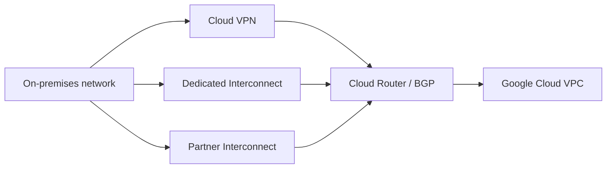
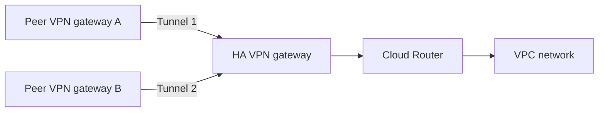
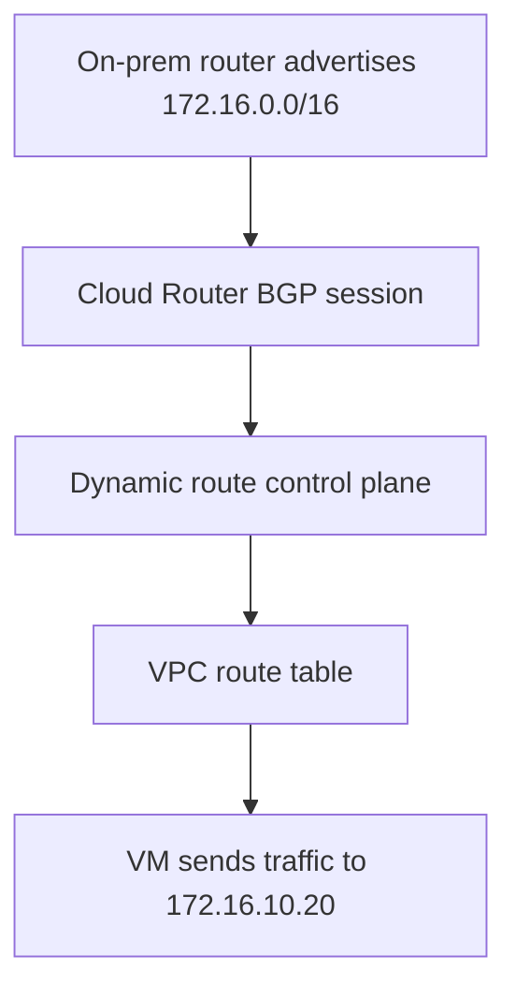
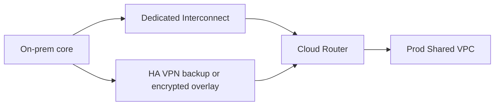

## Introduction to hybrid cloud

Hybrid cloud networking is the discipline of making your on-premises network and your Google Cloud network behave like parts of one system without pretending they are the same environment.

That usually means solving four engineering problems at once:

- private connectivity between sites
- routing between address spaces
- consistent security controls
- reliable failover under maintenance or outages

Most teams do not start with the same requirements. A regional manufacturing company, a bank, and a gaming platform can all need "on-prem to GCP connectivity" but arrive at different answers.

In Google Cloud, the three core hybrid connectivity building blocks are:

| Option | Best short description | Typical fit |
| --- | --- | --- |
| Cloud VPN | Encrypted connectivity over the public internet | Fastest path, low-to-medium bandwidth, migration bridge |
| Dedicated Interconnect | Direct physical connection to Google's network | High bandwidth, predictable performance, serious enterprise estates |
| Partner Interconnect | Provider-mediated private connectivity to Google | Good when you cannot reach a Google colocation site or do not need a full physical circuit |

Cloud Router and BGP sit underneath many production hybrid designs and determine how routes are exchanged and how failover behaves.

### Start with the engineering question, not the product

Ask these first:

- How much traffic must move consistently, not just peak occasionally?
- What latency variation can the application tolerate?
- Is encryption-in-transit mandatory?
- Do you need dynamic routing and automatic failover?
- Can your data center physically reach a Google colocation facility?
- Do you want internet-based transport or a private carrier path?

Those answers usually narrow the choice quickly.

## Cloud VPN

Cloud VPN securely extends your peer network to Google Cloud by using IPsec VPN tunnels.

For many teams, it is the correct first hybrid step because it is:

- fast to deploy
- widely understood
- encrypted by default
- good for pilots, migrations, and moderate traffic volumes

### What Cloud VPN is good at

Cloud VPN is usually a strong choice when you need:

- secure connectivity in days, not months
- a lower entry barrier than private circuits
- a migration bridge while a larger interconnect project is still being built
- backup connectivity for an Interconnect design

### HA VPN versus Classic VPN

For modern production designs, the default answer should be **HA VPN**.

| VPN type | Use it when | Important caveat |
| --- | --- | --- |
| HA VPN | Production hybrid connectivity with BGP and redundancy | Requires peer support for BGP |
| Classic VPN | Static-route legacy or simple cases only | Much weaker long-term fit for modern hybrid networking |

There is an important current product boundary here: **dynamic routing/BGP for Classic VPN was deprecated on August 1, 2025**. For new VPN designs that need BGP, use HA VPN.

### HA VPN architecture

HA VPN gives you two interfaces on the Google side. To achieve the high-availability topology, you typically build two tunnels.

### Engineering tradeoffs

| Dimension | Cloud VPN tradeoff |
| --- | --- |
| Deployment speed | Strongest option |
| Encryption | Native strength |
| Latency predictability | Depends on internet path quality |
| Bandwidth scale | Fine for many workloads, weaker than Interconnect for heavy sustained transfer |
| Operational complexity | Lower than Interconnect |
| Cost shape | Lower entry cost, but traffic-based cost can add up |

### Real-world enterprise use case

A mid-sized SaaS company moving from one private data center to Google Cloud often starts with HA VPN because:

- it can establish secure connectivity quickly
- BGP lets it advertise only the needed prefixes
- the network team can validate CIDR, DNS, firewall, and route behavior before committing to private circuits

That is a good engineering decision if the migration timeline matters more than lowest-latency long-haul performance.

## Dedicated Interconnect

Dedicated Interconnect gives you a direct physical connection between your network and Google's network.

This is the option enterprises choose when hybrid connectivity becomes a platform dependency rather than a convenience layer.

### When it makes sense

Dedicated Interconnect is usually the right answer when you need:

- large and sustained data transfer
- more stable latency and jitter characteristics
- higher reliability topologies for business-critical traffic
- private-path connectivity that does not traverse the public internet

Google's current model is built around physical circuits, and your network must physically meet Google at a supported colocation facility.

### Dedicated Interconnect mental model

### Engineering tradeoffs

| Dimension | Dedicated Interconnect tradeoff |
| --- | --- |
| Deployment speed | Slowest of the three because it involves physical provisioning |
| Performance predictability | Best option of the three |
| Bandwidth | Best fit for large sustained flows |
| Operational overhead | Highest because you manage more network planning and physical dependencies |
| Geography | Requires access to Google-supported colocation locations |
| Cost shape | Higher fixed cost, often better value for large stable traffic volumes |

### Enterprise example

A bank replicating storage, moving large nightly analytics sets, and supporting hybrid identity and database traffic across multiple business units often chooses Dedicated Interconnect because:

- predictable network behavior matters more than quick setup
- traffic volume is high enough to justify the circuit and colocation model
- the organization already has carrier and colocation operations maturity

### Production note

For critical production topologies, you do not design Dedicated Interconnect as a single circuit. You design redundant connections across edge availability domains and often across metros to meet Google's SLA guidance.

One direct link is a lab. Redundant paths are architecture.

## Partner Interconnect

Partner Interconnect provides private connectivity between your network and Google Cloud through a supported service provider.

This is usually the most practical option when:

- your sites cannot reach a Google colocation facility
- you do not need an entire dedicated physical circuit
- you already have a strong relationship with a carrier or network provider

### Why enterprises choose it

Partner Interconnect often wins on organizational reality, not just network theory.

A lot of enterprises have:

- regional branch sites
- metro data centers far from Google colocation
- provider contracts that are easier to extend than new physical builds

In that world, Partner Interconnect gives a private-path model without requiring you to run all the way to Google's physical edge yourself.

### Layer 2 and Layer 3 provider patterns

The docs distinguish between Layer 2 and Layer 3 provider styles:

- With **Layer 2**, you still run BGP between your on-prem router and Cloud Router.
- With **Layer 3**, the service provider handles more of the routing relationship and operational behavior.

That distinction matters operationally because it changes:

- who controls troubleshooting
- who owns routing complexity
- how much visibility your own team has

### Architecture sketch

### Engineering tradeoffs

| Dimension | Partner Interconnect tradeoff |
| --- | --- |
| Deployment speed | Usually faster than Dedicated, slower than VPN |
| Private connectivity | Yes |
| Performance predictability | Better than internet VPN, but influenced by provider design |
| Operational ownership | Shared with provider, which can be a strength or a weakness |
| Geography | Strong option when no direct colo access exists |
| Cost shape | Middle ground, but includes provider commercial dependency |

### Enterprise example

A retailer with regional distribution centers and branch-heavy geography often prefers Partner Interconnect because:

- sites are spread out
- the company already buys WAN services from a carrier
- a direct Google colocation strategy for every site is unrealistic

This is less about "best network purity" and more about building a supportable enterprise operating model.

## Cloud Router and BGP

Cloud Router is Google's managed BGP control-plane service for dynamic routing.

The critical mental model is:

- **Cloud Router exchanges routes**
- **Cloud Router does not forward packets**
- Google's VPC data plane forwards the packets

That distinction matters when debugging hybrid networks. If a tunnel or attachment exists but traffic still fails, the issue can be in:

- route learning
- route advertisement
- next-hop health
- firewall or policy

not in some packet-forwarding "router VM" inside your project.

### What BGP does for hybrid networks

BGP lets each side advertise the prefixes it can reach.

Example:

- on-prem advertises `172.16.0.0/16`
- Google Cloud advertises `10.10.0.0/16`

If your topology changes, BGP updates the path dynamically instead of forcing you to rewrite static routes everywhere.

### BGP basics in plain language

| Term | Meaning |
| --- | --- |
| ASN | The identifier for a routing domain |
| Prefix | A network block such as `172.16.0.0/16` |
| Advertise | Tell a peer "I can reach this range" |
| Learn | Accept a route from a peer |
| Best path | The chosen route when multiple options exist |

### Why BGP matters in production

Static routes can work for one site and one prefix. They become fragile when you have:

- multiple data centers
- failover paths
- many branch networks
- changing address plans
- active/active or active/passive circuit behavior

BGP is not "advanced for the sake of advanced." It is usually the operationally safer choice once the environment grows.

### Route control example

### Regional versus global thinking

In multi-region designs, Cloud Router behavior also interacts with the VPC's dynamic routing mode. If you expect learned hybrid routes to be usable across regions, plan that deliberately. Hybrid reachability problems often come from assumptions about route propagation rather than tunnel health.

## Security considerations

Hybrid connectivity widens your blast radius if you treat it like a simple cable.

A good hybrid design treats routing, trust, and segmentation as separate decisions.

### 1. Private path is not the same as encryption

Cloud VPN gives you encrypted IPsec tunnels. Interconnect gives you private connectivity, but private transport alone is not the same thing as encryption-in-transit.

If encryption is mandatory for Interconnect traffic, plan for:

- HA VPN over Cloud Interconnect
- or other approved encryption controls where your architecture supports them

### 2. Advertise only what should be reachable

Do not advertise giant ranges such as `10.0.0.0/8` unless you truly intend to make that entire space reachable.

Safer pattern:

- summarize carefully
- advertise only necessary prefixes
- review route changes during every major rollout

### 3. Segment trust zones

Do not use hybrid connectivity to erase security boundaries between:

- production and non-production
- user networks and server networks
- restricted data and general application tiers

Hybrid links should connect networks, not collapse trust models.

### 4. Pair routing with firewall policy

A route answers "where can traffic go next?" It does not answer "should this traffic be allowed?"

Use firewall policy to restrict:

- admin ports
- east-west access between sensitive subnets
- unnecessary on-prem-to-cloud reachability

### 5. Design for failure, not just success

Production-grade security includes availability design:

- redundant tunnels or attachments
- separate failure domains
- route behavior tested during failover
- monitoring on BGP session state and path changes

## Cost considerations

Cost design in hybrid networking is mostly about **traffic shape and operating model**, not just list prices.

### Cloud VPN cost profile

Cloud VPN typically has the lowest entry barrier. At a high level, the pricing model includes:

- gateway-related hourly charges
- traffic charges
- possible external IP-related charges depending on usage state

That makes VPN attractive for:

- proofs of concept
- migrations
- smaller steady-state environments

But if traffic becomes large and permanent, VPN can become the wrong long-term economic shape.

### Interconnect cost profile

Cloud Interconnect pricing is built around resource ownership such as:

- physical connections for Dedicated Interconnect
- VLAN attachments
- data transfer pricing

And that is only Google's side. You may also need to account for:

- colocation fees
- router hardware
- optics and cross-connects
- provider contracts
- internal network engineering support

### Practical cost comparison

| Option | Cost shape | What teams often miss |
| --- | --- | --- |
| Cloud VPN | Low entry cost, usage-based growth | It can become expensive or limiting for heavy sustained traffic |
| Dedicated Interconnect | Higher fixed cost, better for large stable traffic | Colocation and operational overhead are part of the real cost |
| Partner Interconnect | Middle ground with provider dependency | Carrier contract and support model matter as much as Google pricing |

### Engineering rule of thumb

- If the workload is **temporary or moderate**, VPN is often economically rational.
- If the workload is **permanent and bandwidth-heavy**, Interconnect often becomes the better long-term platform choice.
- If geography blocks Dedicated Interconnect, Partner Interconnect can be the best practical answer even if it is not the most direct.

## Production architectures

The best hybrid architecture is rarely "pick one product forever." Mature enterprises usually combine products.

### 1. Migration bridge architecture

Best for:

- first cloud adoption
- data-center migration
- limited initial bandwidth

Pattern:

- HA VPN as the primary connection
- Shared VPC or centralized host project for network control
- later upgrade path to Interconnect if traffic grows

### 2. Enterprise primary-private-path architecture

Best for:

- regulated workloads
- heavy database replication
- stable long-term hybrid estate

Pattern:

- Dedicated Interconnect as the primary path
- Cloud Router with BGP
- HA VPN as backup or encrypted overlay when required

### 3. Branch-heavy enterprise architecture

Best for:

- many regional sites
- limited direct colo access
- provider-managed WAN model

Pattern:

- Partner Interconnect for primary private connectivity
- Cloud Router and BGP for route exchange
- selected sites using VPN where provider reach is limited

### 4. Split-by-criticality architecture

This is common in real enterprises:

- non-critical dev and migration traffic uses HA VPN
- critical production data and core services use Interconnect
- both designs are governed by the same central network team

This is often better than forcing every workload onto the same connectivity type.

### Product comparison summary

| Decision factor | Cloud VPN | Dedicated Interconnect | Partner Interconnect |
| --- | --- | --- | --- |
| Fastest deployment | Best | Weak | Medium |
| Highest bandwidth scale | Weakest | Best | Strong |
| Best when no colo access exists | Medium | Poor | Best |
| Native encryption | Best | Needs separate design if required | Needs separate design if required |
| Best for long-term heavy hybrid core | Medium | Best | Strong |
| Best for pilot or migration bridge | Best | Poor | Medium |

## FAQ

**Which product should most teams start with?**  
If you need to connect on-premises to Google Cloud quickly and securely, start by evaluating HA VPN. It is often the best first production-capable step unless your bandwidth and performance needs already point clearly to Interconnect.

**When should I skip VPN and go straight to Interconnect?**  
Skip straight to Interconnect when you already know the environment needs sustained high bandwidth, lower latency variability, private transport, and a long-lived enterprise operating model.

**What is the main difference between Dedicated and Partner Interconnect?**  
Dedicated Interconnect requires your network to physically reach Google's colocation edge. Partner Interconnect uses a supported service provider as the connectivity intermediary.

**Does Cloud Router forward packets?**  
No. Cloud Router manages BGP sessions and dynamic route exchange. Google's VPC data plane forwards the packets.

**Do I always need BGP?**  
No, but once a hybrid environment grows past a very small static design, BGP is usually the safer and more maintainable choice.

**Can I use VPN and Interconnect together?**  
Yes. That is a common production pattern. Teams use VPN as backup connectivity, as an encrypted overlay, or as an interim migration path while Interconnect is being provisioned.

**Is private connectivity automatically secure enough for regulated traffic?**  
Not necessarily. Private transport and encryption are different design properties. Validate your regulatory requirement before assuming Interconnect alone satisfies it.

**Should production and non-production share the same hybrid path?**  
Usually not by default. Mature designs often separate them by connectivity path, route policy, trust zone, or even host project to reduce blast radius and governance risk.
