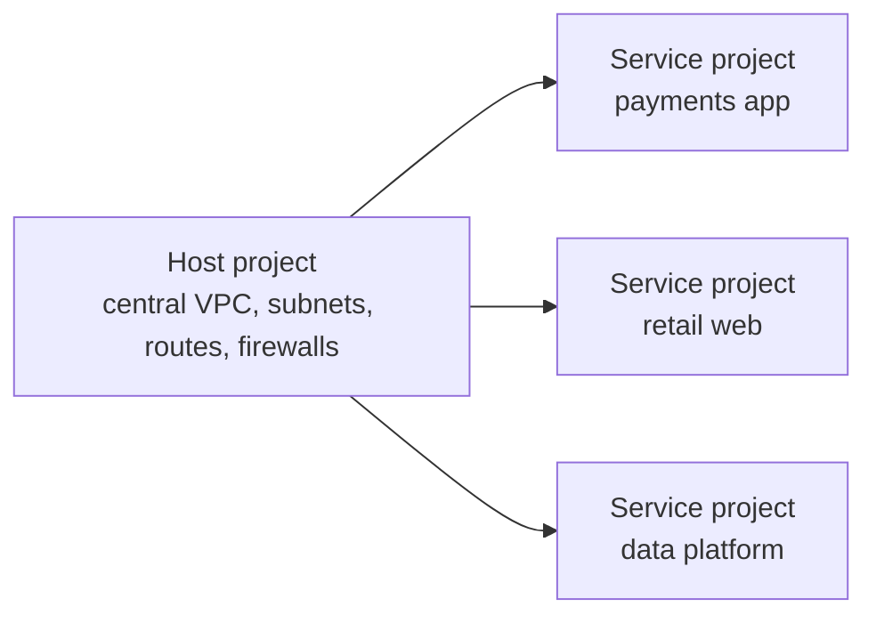
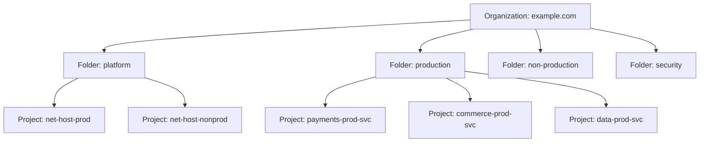
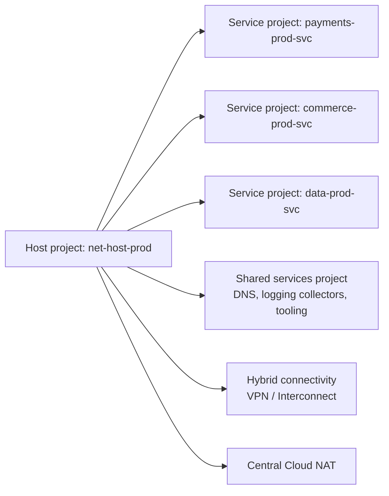
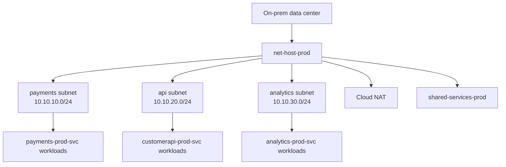

## What is Shared VPC

Shared VPC is a Google Cloud architecture pattern that lets multiple projects use centrally managed VPC networks from one designated **host project**.

In practice, it solves a common enterprise problem:

- platform teams want centralized control of networking
- application teams want autonomy over their own workloads
- security teams want consistent guardrails
- finance teams want costs separated by product or department

Without Shared VPC, every project often creates its own standalone VPC. That works for small teams, but large organizations quickly run into sprawl:

- inconsistent subnet plans
- duplicate firewall logic
- hard-to-audit internet exposure
- overlapping CIDR ranges
- poor hybrid connectivity coordination

Shared VPC changes the model:

- **network resources** such as VPCs, subnets, routes, and firewall rules live in the host project
- **application resources** such as VMs, GKE clusters, and load balancer components can live in service projects
- service project workloads attach to approved subnets from the host project



The result is a clean enterprise split:

- centralized networking
- delegated workload ownership
- stronger policy consistency
- cleaner cost attribution by service project

Two baseline Shared VPC facts matter immediately:

- Host and service projects must normally be in the **same organization**.
- A project cannot be both a host project and a service project at the same time.

## Host projects vs service projects

A good Shared VPC design starts with getting responsibilities right.

### Host project

The host project owns the shared network layer.

Typical resources in the host project:

- VPC networks
- subnets and secondary ranges
- firewall rules and firewall policies
- Cloud Router and Cloud NAT
- hybrid connectivity components such as VPN gateways and Interconnect attachments
- centralized private DNS zones and shared services network controls

### Service project

A service project is attached to a host project and consumes approved subnets from that host.

Typical resources in a service project:

- Compute Engine VMs
- managed instance groups
- GKE clusters
- internal application load balancer components
- service-specific IAM, CI/CD, logs, and deployments

### Comparison table

| Topic | Host project | Service project |
| --- | --- | --- |
| Owns VPC network | Yes | No |
| Owns subnets | Yes | No |
| Creates workloads | Sometimes, but not the main goal | Yes |
| Owns firewall and routing guardrails | Usually yes | Usually no |
| Best for | Central platform networking | Product, team, or environment workloads |

### Project-level attachment, subnet-level delegation

This is one of the most important Shared VPC design details:

- service projects attach to the host at the **project level**
- access to the host network can still be delegated at the **whole host project** or **individual subnet** level using IAM

That means a payments team can be attached to the same host project as a data team, but only receive `compute.networkUser` on the payments subnet instead of every subnet in the host project.

### Real enterprise scenario

Imagine a retail company with three major teams:

- **Payments**
- **E-commerce**
- **Data Platform**

A practical Shared VPC layout is:

| Project | Type | Purpose |
| --- | --- | --- |
| `net-host-prod` | Host | Production shared network |
| `payments-prod-svc` | Service | Payments workloads |
| `commerce-prod-svc` | Service | Web and API workloads |
| `data-prod-svc` | Service | ETL and analytics workloads |

This lets the platform team standardize network controls while each product team keeps separate project ownership and billing.

## IAM considerations

Shared VPC succeeds or fails on IAM design.

The main enterprise lesson is simple: **do not grant broad project owner access and hope governance emerges later**. Shared VPC is designed for deliberate delegation.

### Core roles to know

| Role | Typical scope | Why it exists |
| --- | --- | --- |
| `roles/compute.xpnAdmin` | Organization or folder | Lets a Shared VPC admin enable host projects and attach service projects |
| `roles/compute.networkAdmin` | Host project | Lets network engineers manage VPCs, subnets, routes, and routers |
| `roles/compute.securityAdmin` | Host project | Lets security teams manage firewall rules and security policies |
| `roles/compute.networkUser` | Host project or subnet | Lets service project admins use the shared network or selected subnets |
| `roles/compute.instanceAdmin.v1` | Service project | Lets app teams manage instances and similar compute resources in their own projects |

### Delegation model that works well

Use this pattern for least privilege:

| Team | Recommended access |
| --- | --- |
| Central networking team | `compute.xpnAdmin` at org or folder, `compute.networkAdmin` on host projects |
| Security team | `compute.securityAdmin` on host projects |
| Application team | `compute.instanceAdmin.v1` on its service project, `compute.networkUser` only on approved subnets |
| Platform observability team | Viewer roles plus logging and monitoring access |

### Organization hierarchy example

Many enterprises do not use one giant flat folder. A cleaner pattern looks like this:



This structure helps in three ways:

- network ownership stays in a platform folder
- workloads are separated by environment or business domain
- org-level governance can be layered above both

### IAM examples

Enable a host project:

```bash
gcloud compute shared-vpc enable net-host-prod
```

Attach a service project:

```bash
gcloud compute shared-vpc associated-projects add payments-prod-svc \
  --host-project=net-host-prod
```

Grant subnet-level network use to the payments admins:

```bash
gcloud compute networks subnets add-iam-policy-binding prod-us-central1-payments-snet \
  --project=net-host-prod \
  --region=us-central1 \
  --member='group:payments-admins@example.com' \
  --role='roles/compute.networkUser'
```

Grant workload management rights in the service project:

```bash
gcloud projects add-iam-policy-binding payments-prod-svc \
  --member='group:payments-admins@example.com' \
  --role='roles/compute.instanceAdmin.v1'
```

### Practical IAM rule

If a team only needs one subnet, grant `compute.networkUser` on that subnet, not on the whole host project.

That one decision usually separates a mature Shared VPC deployment from an overly broad one.

## Enterprise topology

Enterprise Shared VPC design is not just "one host, many service projects". You also need to decide:

- whether to split production and non-production hosts
- where shared services live
- how many business domains attach to each host
- how hybrid connectivity and internet egress are centralized

### Recommended topology pattern

For most enterprises, this pattern ages well:

- one **production host project**
- one **non-production host project**
- multiple **service projects per team or product**
- one or more **shared services projects**



### Centralized networking

Shared VPC is attractive because it centralizes:

- CIDR planning
- route management
- firewall policy enforcement
- Cloud NAT design
- hybrid connectivity
- private service connectivity patterns

That reduces accidental architectural drift across teams.

### Security isolation

Shared VPC does **not** mean every team should share every subnet.

A better enterprise pattern is:

- dedicated subnets per product or trust zone
- separate prod and non-prod host projects
- firewall and IAM boundaries between team zones
- separate secondary ranges for GKE where needed

### Cost management

Shared VPC helps cost management because billing remains tied to the project where the resource lives. In practice:

- product workloads in service projects remain visible as separate cost centers
- centrally owned network resources stay in host projects
- shared connectivity components such as VPN gateways or Interconnect attachments can be tracked where they are created

This is one reason large organizations prefer Shared VPC over one giant project for everything.

### Shared services architecture

A shared services project often hosts:

- private DNS zones
- internal package mirrors
- observability collectors
- management tooling
- centralized ingress or egress patterns

This keeps platform functions separate from application projects without scattering network control.

## Production architecture example

Consider a financial services company with these needs:

- one central networking team
- separate payments, customer API, and analytics teams
- private hybrid connectivity to on-prem data centers
- no public IPs on app or database workloads
- strict production versus non-production isolation

### Practical design

| Project | Role | Notes |
| --- | --- | --- |
| `net-host-prod` | Production host | Owns production VPC, subnets, firewalls, Cloud NAT, VPN |
| `net-host-nonprod` | Non-production host | Keeps testing traffic and IAM separate |
| `payments-prod-svc` | Service project | PCI-sensitive payment services |
| `customerapi-prod-svc` | Service project | Customer-facing APIs |
| `analytics-prod-svc` | Service project | Data and ETL jobs |
| `shared-services-prod` | Shared services | DNS, package mirrors, internal tools |

### Topology sketch



### Why this design works

- networking is centralized in `net-host-prod`
- application teams retain ownership of compute in their own service projects
- production and non-production do not share the same host
- hybrid connectivity is managed once instead of repeated per team
- cost visibility remains clean by service project

### Terraform example

The example below models:

- one host project
- two service projects
- one shared VPC network
- team-specific subnets
- service project attachments
- subnet-level `compute.networkUser` delegation

```hcl
terraform {
  required_version = ">= 1.7.0"

  required_providers {
    google = {
      source  = "hashicorp/google"
      version = "~> 7.0"
    }
  }
}

provider "google" {
  project = var.host_project_id
  region  = "us-central1"
}

resource "google_compute_shared_vpc_host_project" "prod_host" {
  project = var.host_project_id
}

resource "google_compute_network" "prod_core" {
  project                 = var.host_project_id
  name                    = "prod-core-vpc"
  auto_create_subnetworks = false
}

resource "google_compute_subnetwork" "payments" {
  project       = var.host_project_id
  name          = "prod-us-central1-payments-snet"
  region        = "us-central1"
  network       = google_compute_network.prod_core.id
  ip_cidr_range = "10.10.10.0/24"
}

resource "google_compute_subnetwork" "commerce" {
  project       = var.host_project_id
  name          = "prod-us-central1-commerce-snet"
  region        = "us-central1"
  network       = google_compute_network.prod_core.id
  ip_cidr_range = "10.10.20.0/24"
}

resource "google_compute_shared_vpc_service_project" "payments" {
  host_project    = google_compute_shared_vpc_host_project.prod_host.project
  service_project = var.payments_service_project_id
}

resource "google_compute_shared_vpc_service_project" "commerce" {
  host_project    = google_compute_shared_vpc_host_project.prod_host.project
  service_project = var.commerce_service_project_id
}

resource "google_compute_subnetwork_iam_member" "payments_network_user" {
  project    = var.host_project_id
  region     = google_compute_subnetwork.payments.region
  subnetwork = google_compute_subnetwork.payments.name
  role       = "roles/compute.networkUser"
  member     = "group:payments-admins@example.com"
}

resource "google_compute_subnetwork_iam_member" "commerce_network_user" {
  project    = var.host_project_id
  region     = google_compute_subnetwork.commerce.region
  subnetwork = google_compute_subnetwork.commerce.name
  role       = "roles/compute.networkUser"
  member     = "group:commerce-admins@example.com"
}

resource "google_project_iam_member" "payments_instance_admin" {
  project = var.payments_service_project_id
  role    = "roles/compute.instanceAdmin.v1"
  member  = "group:payments-admins@example.com"
}

resource "google_project_iam_member" "commerce_instance_admin" {
  project = var.commerce_service_project_id
  role    = "roles/compute.instanceAdmin.v1"
  member  = "group:commerce-admins@example.com"
}

variable "host_project_id" {
  type = string
}

variable "payments_service_project_id" {
  type = string
}

variable "commerce_service_project_id" {
  type = string
}
```

This is a good baseline because it separates:

- network ownership
- subnet access
- compute administration
- team billing

## Security best practices

The most secure Shared VPC design is usually the one that is boringly consistent.

### 1. Use separate host projects for prod and non-prod

This avoids accidental route, firewall, and subnet reuse across environments with very different risk profiles.

### 2. Prefer subnet-level delegation

Grant `roles/compute.networkUser` on the smallest practical subnet scope instead of the whole host project whenever possible.

### 3. Keep network and workload administration separate

Do not give every app team `compute.networkAdmin` on the host project. That defeats the point of centralized network governance.

### 4. Centralize hybrid connectivity and egress

Place:

- Cloud VPN
- Cloud Interconnect
- Cloud NAT
- centralized firewall policy

in the host project unless you have a clear reason not to.

### 5. Use custom-mode VPCs

Enterprise Shared VPC designs benefit from intentional subnet planning. Auto-mode networks rarely age well in large organizations.

### 6. Treat shared services as a first-class architecture layer

Put private DNS, internal mirrors, and common management services into controlled shared services projects instead of scattering them through product teams.

### 7. Audit IAM regularly

The biggest Shared VPC security failures are often IAM failures:

- whole-host `compute.networkUser` granted too broadly
- old service projects still attached
- firewall admins spread across too many groups
- project owners bypassing intended separation

## Common mistakes

- Using one giant host project for everything, including prod and non-prod.
- Granting `compute.networkUser` on the entire host project when a team only needs one subnet.
- Letting application teams manage firewall rules in the host project without a clear governance model.
- Assuming Shared VPC provides security isolation by itself. It improves control, but you still need firewalls, IAM, DNS controls, and segmentation.
- Forgetting that a service project can attach to only one host project at a time.
- Ignoring centralized CIDR planning and then discovering overlap with on-prem or peer networks later.
- Mixing shared services, team workloads, and experimental environments in the same service project.
- Treating Shared VPC as a cost-only feature instead of a network operating model.

## FAQ

**What is the main reason enterprises use Shared VPC?**  
Centralized network control with delegated workload ownership. It lets one team manage the network while other teams run their own applications in separate projects.

**Can a service project attach to multiple host projects?**  
No. A service project can attach to only one host project at a time.

**Should I share the entire host project or only selected subnets?**  
For enterprise environments, selected subnets are usually better. Subnet-level delegation supports least privilege and cleaner separation between teams.

**Who pays for resources in Shared VPC?**  
Billing is generally attributed to the project where the resource lives. That is one reason Shared VPC works well for cost-center separation. Connectivity components such as VPN gateways or Interconnect attachments are billed where those resources are created.

**Does Shared VPC replace VPC peering?**  
No. Shared VPC is for centralized use of one organization's network across multiple projects. VPC Peering connects separate VPC networks.

**Can Shared VPC work with GKE?**  
Yes. It is a common enterprise pattern, especially when platform teams want centralized subnet, secondary range, and firewall management.

**Is one host project enough for the whole company?**  
Usually no. Most mature organizations end up with at least separate host projects for production and non-production, and sometimes additional hosts by region, business unit, or compliance boundary.
