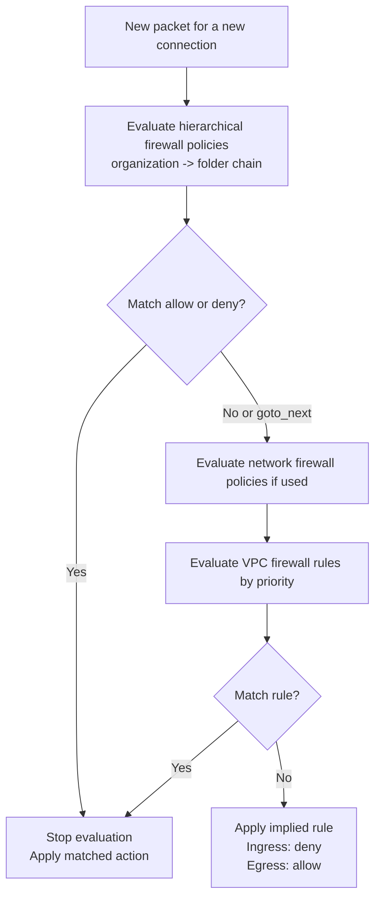
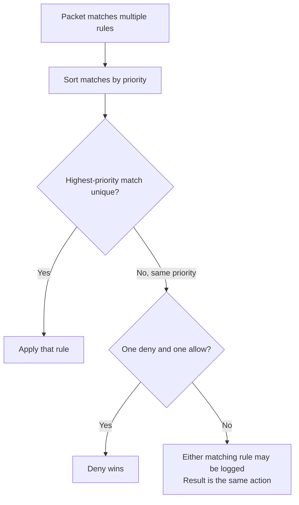
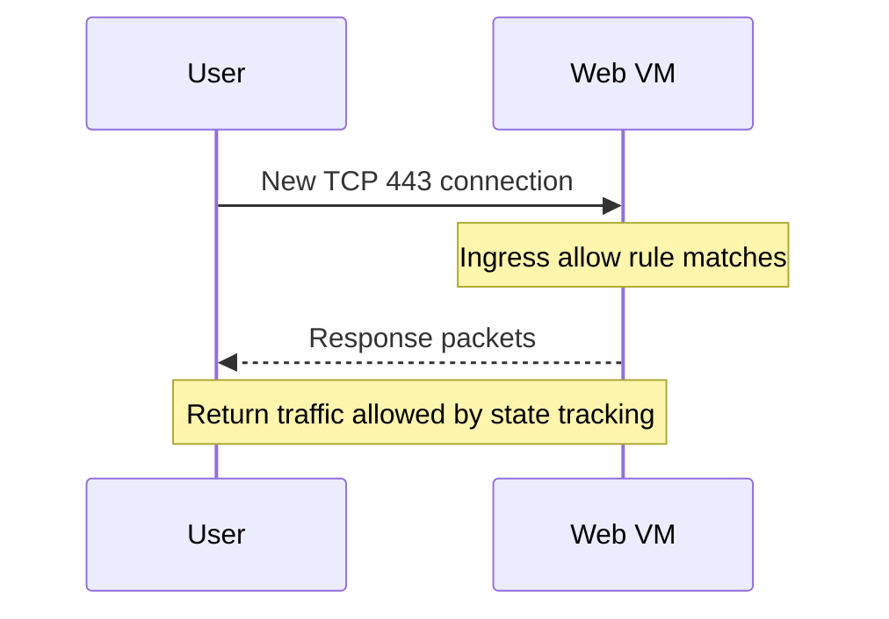
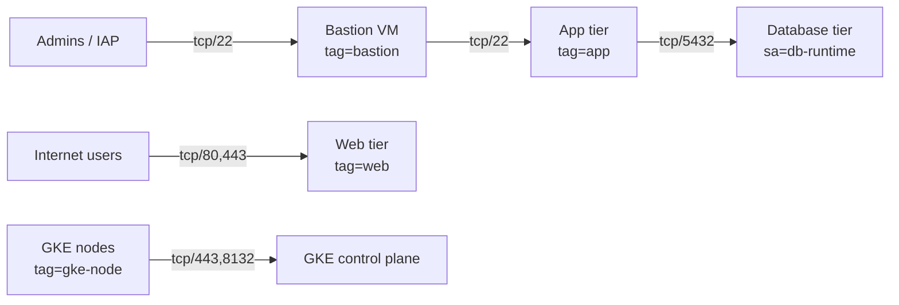

## Introduction

Google Cloud firewall rules look simple at first: allow or deny traffic based on source, destination, protocol, and port. The confusion usually starts later, when traffic still fails even though a rule "looks right" on paper.

The reason is that Google Cloud firewall behavior is shaped by a few non-obvious ideas:

- Rules are created at the VPC level but enforced on each VM network interface.
- Ingress and egress are evaluated separately.
- Rules are stateful, so return traffic is usually allowed automatically.
- Lower numeric priorities win.
- An allow rule does not always beat a deny rule.
- Organization and folder level policies can decide traffic before VPC rules ever run.

This guide uses a small production-style environment to explain how the pieces fit together.

| Component | Example name | Purpose |
| --- | --- | --- |
| VPC | `prod-core-vpc` | Primary application network |
| Bastion VM | `prod-bastion-01` | Controlled admin entry point |
| Web tier | `prod-web-*` | Public-facing workload |
| App tier | `prod-app-*` | Internal application layer |
| DB tier | `prod-db-*` | Private data layer |
| GKE nodes | `prod-gke-*` | Kubernetes worker nodes |

If you are brand new to Google Cloud networking, remember this baseline: **every new connection must be allowed by the applicable ingress or egress evaluation path, but response traffic to an allowed connection is usually allowed automatically**.

## How GCP firewalls work

Google Cloud VPC firewall rules are attached to a VPC network, but enforcement happens on the targets in that network, such as VM network interfaces and GKE nodes. A rule is always either `INGRESS` or `EGRESS`. It never does both.

For most teams, the mental model below is the right starting point:



That diagram is deliberately simplified around the parts most teams actively manage. In modern Google Cloud, hierarchical policies are always evaluated before classic VPC firewall rules. If your VPC also uses global or regional network firewall policies, their placement relative to classic VPC rules depends on the network firewall policy enforcement order.

The core rule fields are:

| Field | What it means | Practical guidance |
| --- | --- | --- |
| Direction | `INGRESS` or `EGRESS` | Start by deciding who initiates the connection |
| Action | `allow` or `deny` | Use explicit deny for risky traffic, not broad allow + hope |
| Priority | Lower number = higher priority | Leave gaps like `900`, `1000`, `1100` |
| Targets | Which VMs the rule applies to | Prefer service accounts for stronger control |
| Source / destination | Who can talk to whom | Use narrow CIDRs or workload identity criteria |
| Protocol and ports | L4 match | Be specific: `tcp:22`, not `all` |
| Logging | Connection records for rule matches | Enable on sensitive allow/deny rules |

Google Cloud also has **implied rules**:

- **Implied ingress deny**: if no applicable ingress rule allows traffic to a VM, the traffic is denied.
- **Implied egress allow**: if no applicable egress rule denies traffic from a VM, the traffic is allowed.

That means a "no rules" VPC is not fully open. It is effectively:

- closed by default for new inbound traffic
- open by default for new outbound traffic

### Allow vs deny

An `allow` rule permits a new connection if it matches the rest of the rule. A `deny` rule blocks a new connection if it matches. You cannot put both actions in the same rule.

A common production pattern is:

- high-priority narrow allows for approved traffic
- lower-priority deny rules for broad unwanted traffic
- minimal reliance on default implied behavior when auditability matters

### Tags vs service accounts

Network tags and service accounts are both valid targeting tools, but they solve different problems.

| Option | Best for | Weakness |
| --- | --- | --- |
| Network tags | Fast grouping like `web`, `bastion`, `gke-node` | Any principal who can edit the instance can change the tag |
| Service accounts | Stronger workload identity boundaries | Changing a VM service account requires stop/start |

Use **service accounts** when you need tighter security boundaries between workloads. Use **tags** when you need lightweight grouping and you trust the operational model around instance edits.

Important limitation: **you cannot mix service accounts and network tags in the same firewall rule**.

### Logging

Firewall Rules Logging is enabled per rule, not globally. It creates connection records in Cloud Logging for traffic that matches the rule. In practice:

- turn it on for internet-facing allow rules
- turn it on for high-risk deny rules such as SSH from `0.0.0.0/0`
- omit metadata on noisy rules when cost matters

One production caveat matters here: firewall rule logging records TCP and UDP connections, not every protocol. It is useful, but it is not a full packet capture.

If you prefer the console, the path is **VPC network > Firewall > Create firewall rule** for classic rules, and **Firewall policies** for organization and folder policies.

## Rule priority

Priority is where most real-world mistakes happen.

For VPC firewall rules, the priority range is `0` to `65535`. Lower numbers have higher precedence. If you omit a priority, Google Cloud uses `1000`.

The evaluation rules are:

- Lower number wins over higher number.
- Target specificity does not beat priority.
- A `deny` only beats an `allow` automatically when both rules have the **same priority**.
- If two same-priority same-action rules match, the result is the same, but the logged rule can be indeterminate.

This is the production-safe way to think about it:

| Rule | Priority | Result |
| --- | --- | --- |
| Allow SSH from bastion to app | `900` | Wins before broader deny |
| Deny SSH from internet to app | `1000` | Blocks everyone else |
| Allow HTTPS from internet to web | `1000` | Normal public web access |
| Catch-all internal deny | `2000` | Fallback guardrail |

Rule evaluation for a single packet looks like this:



A classic example is SSH hardening for application servers:

- `prod-allow-ssh-from-bastion` at priority `900`
- `prod-deny-ssh-from-internet` at priority `1000`

Because `900` is higher priority than `1000`, bastion traffic is allowed first. Internet traffic still hits the lower-priority deny.

### gcloud example

```bash
gcloud compute firewall-rules create prod-allow-ssh-from-bastion \
  --network=prod-core-vpc \
  --direction=ingress \
  --action=allow \
  --priority=900 \
  --rules=tcp:22 \
  --source-tags=bastion \
  --target-tags=app \
  --enable-logging \
  --logging-metadata=include-all

gcloud compute firewall-rules create prod-deny-ssh-from-internet \
  --network=prod-core-vpc \
  --direction=ingress \
  --action=deny \
  --priority=1000 \
  --rules=tcp:22 \
  --source-ranges=0.0.0.0/0 \
  --target-tags=app \
  --enable-logging \
  --logging-metadata=include-all
```

### Priority conventions that age well

Many teams reserve bands instead of filling priorities one by one.

| Priority band | Typical use |
| --- | --- |
| `0-199` | Organization-wide emergency deny or mandatory control |
| `200-499` | Shared platform and connectivity rules |
| `500-899` | Admin access and private service controls |
| `900-1199` | Application allow rules |
| `1200-1999` | Lower-priority fallbacks and explicit denials |
| `65000-65535` | Leave for implied behavior and vendor-managed defaults |

The exact numbers do not matter as much as consistency and spacing.

## Stateful behavior

Google Cloud VPC firewall rules are **stateful**. That means when a new connection is allowed in one direction, the response traffic is automatically allowed back if it matches the same 5-tuple with source and destination reversed.

In practical terms:

- If a user connects to your web server on TCP 443 and ingress is allowed, the server's return traffic is automatically allowed.
- If an app VM initiates a TCP 5432 connection to a database and egress plus ingress allow it, the database response traffic does not need a separate return rule.
- You cannot create a rule that denies only the response leg of an already allowed stateful connection.



This behavior is why you should evaluate the **initiating side** first. If a connection fails, ask:

1. Which side started the connection?
2. Was that new connection allowed?
3. Did a higher-priority deny block it first?

There are also production caveats:

- Connection tracking capacity depends on the machine type.
- A state entry stays active while traffic continues; long idle periods can age it out.
- Fragmented traffic has edge cases. For example, later TCP fragments are not matched the same way as the first fragment carrying the TCP header.

For beginners, the main lesson is simple: **do not create extra "return port" rules unless you are solving a very specific protocol or fragmentation case**.

## Common firewall architectures

The fastest way to learn firewall design is to map it to common production paths.



### 1. SSH access

Avoid direct internet SSH to every server. A better baseline is:

- use IAP TCP forwarding or a bastion
- restrict SSH to a small admin source range or IAP range
- enable logging
- keep a lower-priority deny in place for broad internet SSH

Example:

| Rule name | Source | Target | Ports | Priority |
| --- | --- | --- | --- | --- |
| `prod-allow-iap-ssh-to-bastion` | `35.235.240.0/20` | `bastion` tag | `tcp:22` | `900` |
| `prod-allow-ssh-from-bastion` | `bastion` tag | `app` tag | `tcp:22` | `900` |
| `prod-deny-ssh-from-internet` | `0.0.0.0/0` | `app` tag | `tcp:22` | `1000` |

### 2. HTTP and HTTPS

For public web workloads, allow only the ports you actually publish.

| Rule name | Source | Target | Ports | Guidance |
| --- | --- | --- | --- | --- |
| `prod-allow-web-ingress` | `0.0.0.0/0` | `web` tag | `tcp:80,tcp:443` | Fine for internet-facing web tier |
| `prod-deny-admin-to-web` | `0.0.0.0/0` | `web` tag | `tcp:22,tcp:3389` | Good explicit protection |

If you place the web tier behind a load balancer, narrow health-check and backend rules separately instead of opening broad admin ports.

### 3. Internal communication

Do not recreate the default network habit of allowing the whole VPC CIDR to talk to everything on every port. Instead, grant east-west access intentionally.

A production-safe pattern is:

- app to database on `tcp:5432`
- app to Redis on `tcp:6379`
- metrics scraping on known ports from known monitoring sources

For strong segmentation, prefer service-account-based rules:

| Rule name | Source service account | Target service account | Port |
| --- | --- | --- | --- |
| `prod-allow-app-to-db-postgres` | `app-runtime@PROJECT_ID.iam.gserviceaccount.com` | `db-runtime@PROJECT_ID.iam.gserviceaccount.com` | `tcp:5432` |

### 4. Bastion access

A bastion should be an exception layer, not a permanent side door.

- place it in a management subnet
- allow inbound admin traffic only from IAP or trusted office/VPN ranges
- allow outbound SSH only to approved targets
- keep admin rules heavily logged

### 5. Kubernetes traffic

GKE changes the discussion in two important ways:

- GKE automatically creates and manages certain **ingress allow** firewall rules for nodes, control plane access, and some Services.
- GKE relies on the **implied allow egress rule** unless you create stricter egress denies.

That leads to two production rules of thumb:

- Do not manually delete or rewrite GKE-managed firewall rules.
- If you add broad egress deny rules, explicitly allow node-to-control-plane traffic on `tcp:443`. If you use Konnectivity and block all egress, also allow `tcp:8132`.

Another important limitation is easy to miss: **VPC firewall rules that use service accounts apply to GKE nodes, not Pods**. If you want Pod-to-Pod or namespace-level controls, you also need Kubernetes network policies or Dataplane V2 features.

### Terraform examples

The following example shows practical classic VPC firewall rules with modern Terraform syntax.

```hcl
terraform {
  required_version = ">= 1.7.0"

  required_providers {
    google = {
      source  = "hashicorp/google"
      version = "~> 6.0"
    }
  }
}

provider "google" {
  project = var.project_id
  region  = "us-central1"
}

resource "google_compute_network" "prod" {
  name                    = "prod-core-vpc"
  auto_create_subnetworks = false
}

resource "google_compute_firewall" "allow_iap_ssh_to_bastion" {
  name        = "prod-allow-iap-ssh-to-bastion"
  description = "Allow IAP administrators to reach bastion hosts"
  network     = google_compute_network.prod.name
  direction   = "INGRESS"
  priority    = 900

  source_ranges = ["35.235.240.0/20"]
  target_tags   = ["bastion"]

  allow {
    protocol = "tcp"
    ports    = ["22"]
  }

  log_config {
    metadata = "INCLUDE_ALL_METADATA"
  }
}

resource "google_compute_firewall" "allow_web_ingress" {
  name        = "prod-allow-web-ingress"
  description = "Allow public HTTP and HTTPS to web instances"
  network     = google_compute_network.prod.name
  direction   = "INGRESS"
  priority    = 1000

  source_ranges = ["0.0.0.0/0"]
  target_tags   = ["web"]

  allow {
    protocol = "tcp"
    ports    = ["80", "443"]
  }

  log_config {
    metadata = "EXCLUDE_ALL_METADATA"
  }
}

resource "google_compute_firewall" "allow_bastion_to_app_ssh" {
  name        = "prod-allow-bastion-to-app-ssh"
  description = "Allow bastion hosts to reach app instances over SSH"
  network     = google_compute_network.prod.name
  direction   = "INGRESS"
  priority    = 900

  source_tags = ["bastion"]
  target_tags = ["app"]

  allow {
    protocol = "tcp"
    ports    = ["22"]
  }

  log_config {
    metadata = "INCLUDE_ALL_METADATA"
  }
}

resource "google_compute_firewall" "deny_internet_ssh_to_app" {
  name        = "prod-deny-internet-ssh-to-app"
  description = "Block direct SSH from the internet to app instances"
  network     = google_compute_network.prod.name
  direction   = "INGRESS"
  priority    = 1000

  source_ranges = ["0.0.0.0/0"]
  target_tags   = ["app"]

  deny {
    protocol = "tcp"
    ports    = ["22"]
  }

  log_config {
    metadata = "INCLUDE_ALL_METADATA"
  }
}

resource "google_compute_firewall" "allow_app_to_db_postgres" {
  name        = "prod-allow-app-to-db-postgres"
  description = "Allow app service account to reach database on PostgreSQL"
  network     = google_compute_network.prod.name
  direction   = "INGRESS"
  priority    = 800

  source_service_accounts = [
    "app-runtime@${var.project_id}.iam.gserviceaccount.com",
  ]

  target_service_accounts = [
    "db-runtime@${var.project_id}.iam.gserviceaccount.com",
  ]

  allow {
    protocol = "tcp"
    ports    = ["5432"]
  }

  log_config {
    metadata = "INCLUDE_ALL_METADATA"
  }
}

resource "google_compute_firewall" "allow_gke_control_plane_egress" {
  name        = "prod-allow-gke-control-plane-egress"
  description = "Only needed when you use restrictive egress policies for GKE nodes"
  network     = google_compute_network.prod.name
  direction   = "EGRESS"
  priority    = 800

  destination_ranges = ["172.16.0.32/28"]
  target_tags        = ["gke-node"]

  allow {
    protocol = "tcp"
    ports    = ["443", "8132"]
  }

  log_config {
    metadata = "EXCLUDE_ALL_METADATA"
  }
}

variable "project_id" {
  type = string
}
```

Replace the GKE control plane CIDR with your actual private control plane range if you use restrictive egress rules.

### gcloud examples

```bash
gcloud compute firewall-rules create prod-allow-iap-ssh-to-bastion \
  --network=prod-core-vpc \
  --direction=ingress \
  --action=allow \
  --priority=900 \
  --rules=tcp:22 \
  --source-ranges=35.235.240.0/20 \
  --target-tags=bastion \
  --enable-logging \
  --logging-metadata=include-all

gcloud compute firewall-rules create prod-allow-web-ingress \
  --network=prod-core-vpc \
  --direction=ingress \
  --action=allow \
  --priority=1000 \
  --rules=tcp:80,tcp:443 \
  --source-ranges=0.0.0.0/0 \
  --target-tags=web \
  --enable-logging \
  --logging-metadata=exclude-all

gcloud compute firewall-rules create prod-allow-app-to-db-postgres \
  --network=prod-core-vpc \
  --direction=ingress \
  --action=allow \
  --priority=800 \
  --rules=tcp:5432 \
  --source-service-accounts=app-runtime@PROJECT_ID.iam.gserviceaccount.com \
  --target-service-accounts=db-runtime@PROJECT_ID.iam.gserviceaccount.com \
  --enable-logging \
  --logging-metadata=include-all
```

## Production security strategy

A good production firewall strategy is not a large list of random rules. It is a layered policy model.

### Layer 1: Hierarchical firewall policies

Hierarchical firewall policies let you apply guardrails at the organization or folder level. They are useful for controls that should be true everywhere, such as:

- deny direct SSH from the public internet to sensitive workloads
- enforce allowed admin networks
- block known risky egress destinations
- create baseline logging for critical rules

Key things to remember:

- They are evaluated before classic VPC firewall rules.
- Lower-level rules cannot override a higher-level match.
- They support `goto_next` so evaluation can continue to lower layers.
- They do **not** support network tags for targeting. Use target VPC networks or target service accounts instead.

### Hierarchical policy gcloud example

```bash
gcloud compute firewall-policies create \
  --organization=ORG_ID \
  --short-name=prod-baseline

gcloud compute firewall-policies rules create 900 \
  --firewall-policy=prod-baseline \
  --organization=ORG_ID \
  --direction=ingress \
  --action=deny \
  --src-ip-ranges=0.0.0.0/0 \
  --target-service-accounts=app-runtime@PROJECT_ID.iam.gserviceaccount.com \
  --layer4-configs=tcp:22 \
  --enable-logging
```

### Hierarchical policy Terraform example

```hcl
resource "google_compute_firewall_policy" "prod_baseline" {
  parent      = "organizations/123456789"
  short_name  = "prod-baseline"
  description = "Organization baseline firewall policy"
}

resource "google_compute_firewall_policy_rule" "deny_public_ssh_to_apps" {
  firewall_policy         = google_compute_firewall_policy.prod_baseline.name
  description             = "Block direct public SSH to application workloads"
  priority                = 900
  action                  = "deny"
  direction               = "INGRESS"
  enable_logging          = true
  target_service_accounts = ["app-runtime@PROJECT_ID.iam.gserviceaccount.com"]

  match {
    src_ip_ranges = ["0.0.0.0/0"]

    layer4_configs {
      ip_protocol = "tcp"
      ports       = ["22"]
    }
  }
}
```

### Layer 2: VPC-local rules

Use classic VPC firewall rules for application-specific behavior inside a network:

- web ingress for one VPC
- app-to-db traffic
- temporary maintenance access
- environment-specific exceptions

### Layer 3: Logging and review

Treat firewall rules like code:

- name them clearly: `env-purpose-direction-scope`
- enable logs for risky or externally reachable paths
- review unused rules regularly
- prefer change tickets and Terraform over manual console drift

### Production recommendations

| Control | Recommendation |
| --- | --- |
| SSH | Prefer IAP or bastion, never `0.0.0.0/0` directly to app or DB tiers |
| Public ingress | Limit to `80` and `443` unless you have a concrete reason |
| East-west traffic | Allow by workload pair and port, not by broad VPC CIDR |
| Identity | Prefer service accounts for high-trust segmentation |
| Logging | Turn on for critical allow and deny rules |
| GKE | Do not delete GKE-managed rules; design around them |
| Policy model | Put global guardrails in hierarchical policies, local behavior in VPC rules |

## Troubleshooting connectivity

When traffic fails, the safest process is deterministic:

1. Identify the initiator.
2. Check whether the connection is ingress or egress from that initiator's perspective.
3. List rules in priority order.
4. Look for a higher-priority deny.
5. Check hierarchical policy inheritance.
6. Confirm routing and external/private path assumptions.
7. Use logs or Connectivity Tests to verify the actual match.

These commands are useful in day-to-day debugging:

```bash
gcloud compute firewall-rules list \
  --filter='network=prod-core-vpc AND direction=INGRESS' \
  --sort-by=priority \
  --format='table(name,direction,priority,sourceRanges.list():label=SRC,allowed[].map().firewall_rule().list():label=ALLOW,denied[].map().firewall_rule().list():label=DENY,targetTags.list():label=TARGET_TAGS,targetServiceAccounts.list():label=TARGET_SA)'

gcloud compute firewall-rules list \
  --filter='network=prod-core-vpc AND direction=EGRESS' \
  --sort-by=priority \
  --format='table(name,direction,priority,destinationRanges.list():label=DEST,allowed[].map().firewall_rule().list():label=ALLOW,denied[].map().firewall_rule().list():label=DENY,targetTags.list():label=TARGET_TAGS,targetServiceAccounts.list():label=TARGET_SA)'

gcloud compute firewall-rules describe prod-allow-web-ingress
```

Use the table below when narrowing the cause.

| Symptom | Likely cause | What to check |
| --- | --- | --- |
| Cannot SSH to app VM | Higher-priority deny or wrong target | Bastion allow rule, deny precedence, target tag or service account |
| Web app unreachable | Missing ingress allow or health-check rule | Port `80/443`, backend health checks, public path assumptions |
| App cannot reach DB | Missing egress or DB ingress allow | Initiator side, DB port rule, service-account targeting |
| GKE workloads fail after egress hardening | Missing control-plane or node egress rule | `tcp:443`, `tcp:8132`, node-to-Pod ranges |
| Rule exists but has no effect | Wrong VPC, wrong service account, or higher policy wins | Effective firewalls, hierarchical policy inheritance, host vs service project in Shared VPC |

If you want ground truth beyond rule inspection, use **Connectivity Tests** and **Firewall Rules Logging** together. Connectivity Tests helps you model the path. Logs show which rule actually allowed or denied the connection.

## Common mistakes

- Opening `tcp:22` from `0.0.0.0/0` because it is easy during setup, then forgetting to remove it.
- Assuming a more specific rule automatically wins even when it has a lower priority number. In Google Cloud, priority beats specificity.
- Assuming `allow` always overrides `deny`. It only does when it has a **higher priority** than the deny.
- Forgetting that ingress and egress are separate. An ingress allow on the destination does not rescue a source VM blocked by egress deny.
- Mixing service accounts and tags in the same rule. Google Cloud does not allow that combination.
- Using tags for sensitive segmentation where any instance editor can change the tag and widen access.
- Applying service-account-based rules and expecting them to target GKE Pods. They target nodes, not Pods.
- Deleting or modifying GKE-managed firewall rules and then wondering why the cluster becomes unstable.
- Relying entirely on the implied allow egress behavior in production without documenting the outbound posture.
- Writing priorities too tightly, such as `1000`, `1001`, `1002`, leaving no clean room for emergency inserts.

## FAQ

**Do I need separate inbound and outbound rules for the return path of a TCP connection?**  
Usually no. VPC firewall rules are stateful, so response traffic for an allowed connection is automatically allowed while the connection state exists.

**What wins if two rules match?**  
The rule with the lower numeric priority wins. If two rules with the same priority both match and one is `deny`, the deny wins.

**Should I use network tags or service accounts?**  
Use service accounts when you need stronger workload identity control. Use tags when you need simple grouping and can tolerate looser change control.

**Can hierarchical firewall policies replace all VPC firewall rules?**  
Not usually. Hierarchical policies are best for shared guardrails. VPC firewall rules are still useful for workload-specific behavior inside a single network.

**Can I log every firewall rule?**  
You can, but it is rarely the best cost/performance tradeoff. Turn on logging first for public ingress, admin access, sensitive deny rules, and critical east-west paths.

**Why did my rule not apply to a GKE Pod?**  
Because VPC firewall rules target VM network interfaces and GKE nodes, not Pods. For Pod-level isolation, use Kubernetes network policies and related GKE controls.

**If I use Shared VPC, which hierarchy matters for hierarchical firewall policies?**  
The host project's network hierarchy matters for the VM interface attached to the shared network. That detail is easy to miss during troubleshooting.

**Is the implied allow egress rule good enough for production?**  
Sometimes for simple environments, yes. But mature environments usually move toward explicit outbound policy for auditability and data exfiltration control.
