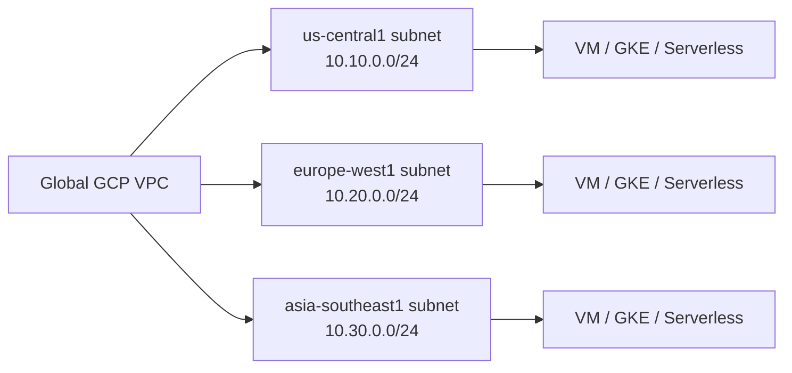
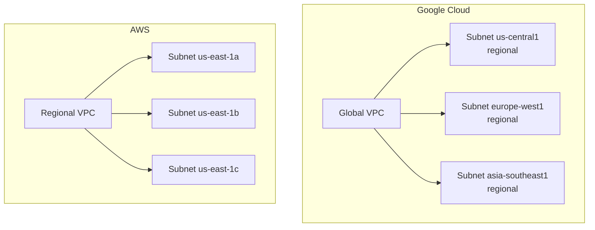
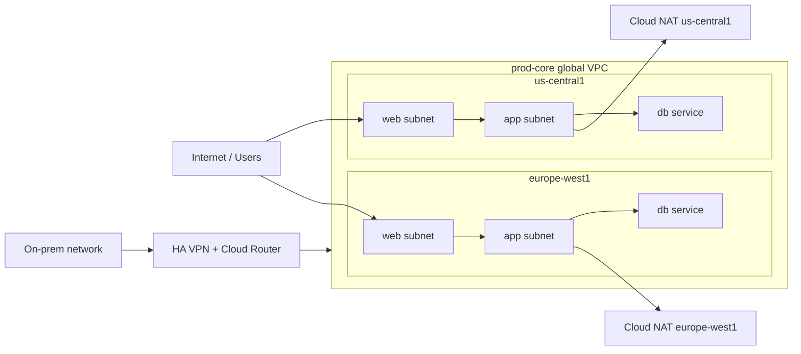

## Introduction

If you want to build reliable systems in Google Cloud, you need a clear mental model of Virtual Private Cloud, usually shortened to **VPC**. VPC design affects how your applications communicate, how private services are exposed, how hybrid connectivity works, and how security boundaries are enforced.

For beginners, GCP networking often feels unusual because Google Cloud does not model networks the same way many engineers first learn them in AWS or in on-prem data centers. The big difference is this: **a GCP VPC is a global network resource, while its subnets are regional resources**. That single design choice changes how you think about IP planning, service placement, routing, and growth.

Use this guide as a foundation layer. The goal is not to teach every networking feature in one sitting. The goal is to make advanced topics such as Cloud NAT, Shared VPC, Private Service Connect, hybrid routing, and multi-region design much easier to learn next.

## What is a VPC

A **VPC** is your private virtual network inside a cloud platform. It is the network boundary where your compute resources get IP addresses, exchange traffic, and apply routing and security controls.

The simplest real-world analogy is an **office campus**:

- The **VPC** is the campus boundary and internal road system.
- A **subnet** is a building or floor with its own address range.
- A **route** is a sign that tells traffic where to go next.
- A **firewall rule** is the security desk that decides who can enter or leave.
- **Cloud NAT** is the reception desk that lets private employees go out to the internet without giving every employee a public phone number.

In Google Cloud, a VPC is not tied to one data center or one region. It is a virtual network built on Google's private backbone. You can place subnets in multiple regions and keep them inside the same VPC. That is the first concept most engineers need to internalize before anything else starts making sense.

Diagram idea: show one VPC as a single container spanning multiple regions, with separate subnets in `us-central1`, `europe-west1`, and `asia-southeast1`.

## Core Networking Components

Before you design anything in GCP, you should know the components below and what job each one does.

- **VPC network**: The top-level private network object. In Google Cloud, it is global.
- **Subnet**: A regional IP range inside the VPC. Resources in a given region attach to subnets in that same region.
- **Primary IP range**: The main CIDR block used by resources in the subnet.
- **Secondary IP ranges**: Extra CIDR blocks often used by GKE for Pods and Services.
- **Route**: A rule that decides where egress traffic should go based on destination.
- **Firewall rule**: An allow or deny rule for ingress or egress traffic. In GCP, firewall rules are defined at the VPC level but enforced per instance.
- **Network tags and service accounts**: Common ways to target firewall rules at specific workloads.
- **Cloud Router**: A managed BGP control-plane service for dynamic routing with Cloud VPN, Cloud Interconnect, and some multicloud or hybrid patterns. It does not forward packets itself.
- **Cloud NAT**: Managed outbound NAT so private workloads can reach the internet or external destinations without public IPs.
- **VPC Network Peering**: Private connectivity between VPCs.

Practical example: imagine a three-tier app in `us-central1`.

- Web subnet: `10.10.1.0/24`
- App subnet: `10.10.2.0/24`
- Data subnet: `10.10.3.0/24`
- Firewall intent:
- Allow HTTPS from the internet to the web tier.
- Allow only app tier to reach the database tier on the database port.
- Deny unnecessary east-west traffic by default.
- Cloud NAT:
- Let app servers download OS packages or reach external APIs without public IPs.

Production insight: most mature teams use **custom mode VPCs**, not auto mode VPCs. Auto mode is convenient for labs, but it creates automatic regional subnets and reduces control over IP planning.

Production insight: firewall rules in GCP are **stateful**. If you allow a connection in one direction, the return traffic is allowed automatically. That is useful, but it also means you need to think in terms of connection initiation rather than just raw packet direction.

## Global vs Regional Architecture

This is the section that usually changes how engineers think about GCP networking.

In AWS, a VPC lives inside a single region, and subnets live inside a single Availability Zone. In Google Cloud, the VPC itself is global, while subnets are regional. That means one logical VPC can include subnets in `us-central1`, `europe-west1`, and `asia-southeast1` at the same time.

That does **not** mean one subnet stretches across the world. A subnet still belongs to one region only. If you deploy a VM in `europe-west1-b`, it must attach to a subnet from `europe-west1`.

Why this matters in practice:

- **IP planning is simpler** because one global VPC can host many regional deployments.
- **Multi-region expansion is cleaner** because you add regional subnets instead of building a separate VPC per region by default.
- **Routing feels different** because Google uses a distributed VPC-level routing model instead of subnet-associated route tables.
- **Hybrid routing needs care** because Cloud Router behavior depends on the VPC's dynamic routing mode, which can be `regional` or `global`.

AWS comparison:

- **GCP VPC**: Global resource.
- **AWS VPC**: Regional resource.
- **GCP subnet**: Regional resource.
- **AWS subnet**: Single Availability Zone resource.
- **GCP routing**: Distributed at the VPC level.
- **AWS routing**: Route tables associated with subnets or gateways.
- **GCP firewall model**: VPC firewall rules defined at network level and enforced per instance.
- **AWS firewall model**: Security groups on ENIs or instances plus network ACLs at the subnet boundary.

Production insight: teams moving from AWS often over-segment GCP too early because they assume "one region means one VPC." That usually creates unnecessary peering, more policy duplication, and harder IP management.

Diagram idea: place one global VPC at the top, then show regional subnets beneath it. Next to it, place one AWS regional VPC with AZ-specific subnets to contrast the models.

## Why Networking Matters in Cloud Engineering

Networking is where architecture becomes real. You can write clean application code and still end up with a weak platform if the network is poorly designed.

Here is what networking decisions affect immediately:

- **Security**: which workloads are reachable and from where.
- **Reliability**: whether services fail cleanly across regions, zones, or hybrid links.
- **Performance**: latency between components, internet egress paths, and load balancer placement.
- **Operations**: how easy it is to troubleshoot packet flow, DNS, routing, and firewall behavior.
- **Scalability**: whether your IP ranges, routing model, and segmentation still work after the company doubles in size.
- **Cost**: internet egress, inter-region traffic, NAT usage, load balancing, and duplicated network appliances.

Real-world analogy: bad network design is like building a warehouse with no loading map, no door labels, and no traffic rules. The warehouse exists, but daily operations slow down, incidents take longer, and every new team invents its own workaround.

Production insight: strong cloud engineers do not treat networking as a specialist-only topic. You do not need to become a BGP expert on day one, but you do need to understand how packets move between your workloads, your users, and your dependencies.

## Real Production Example

Imagine a SaaS platform with users in North America and Europe. The company runs:

- Public web services in `us-central1` and `europe-west1`
- Private application services in both regions
- A managed database tier reachable only from application workloads
- Private outbound access through Cloud NAT
- A site-to-site VPN back to an on-prem office for internal tools and identity services

One practical design could look like this:

- One custom mode global VPC named `prod-core`
- Regional subnets:
- `10.10.10.0/24` for web in `us-central1`
- `10.10.20.0/24` for app in `us-central1`
- `10.20.10.0/24` for web in `europe-west1`
- `10.20.20.0/24` for app in `europe-west1`
- Firewall rules:
- Allow HTTPS to web tier
- Allow app-to-db only on required ports
- Allow admin access only from approved corporate ranges
- Deny broad internal access patterns that are not explicitly needed
- Cloud NAT in each active region for private outbound traffic
- Cloud Router with dynamic routing for the hybrid VPN connection

Why this is production-friendly:

- The IP plan is readable by region and tier.
- Workloads stay private unless there is a deliberate public entry point.
- Regional failure domains are easier to reason about.
- Hybrid routes can scale without hardcoding every network path manually.

Diagram idea: show global VPC on top, two regional stacks below, internet ingress to web only, app tier private, database private, Cloud NAT for outbound, and Cloud VPN plus Cloud Router to on-prem.

## Common Beginner Misunderstandings

- **"Global VPC means global subnets."**
- False. The VPC is global. The subnet is regional.
- **"Cloud Router is a virtual router appliance that forwards packets."**
- False. Cloud Router is a managed control-plane service for BGP and dynamic route exchange. It is not the packet-forwarding data plane.
- **"No external IP means the VM cannot reach the internet."**
- False. Private instances can still reach the internet through Cloud NAT if routing and firewall rules allow it.
- **"Firewall rules attach to subnets."**
- False. GCP VPC firewall rules are associated with the network and enforced per instance. Targeting is usually done with tags or service accounts.
- **"The default VPC is good enough for production."**
- Usually false. The default network is useful for quick testing, but production environments normally need custom IP planning, tighter firewall rules, and clearer segmentation.
- **"If two resources are in the same VPC, access is automatically safe."**
- False. Reachability is not the same as good security design. East-west traffic needs explicit control.

Production insight: the most expensive network mistakes are usually not syntax mistakes. They are **mental model mistakes**. Engineers design the wrong abstraction, and the platform becomes harder to secure and scale for years.

## Summary

If you remember only a few things from this guide, remember these:

- A **GCP VPC is global**.
- A **GCP subnet is regional**.
- **Routes** define where traffic goes.
- **Firewall rules** define which connections are allowed or denied.
- **Cloud Router** handles dynamic route exchange, not packet forwarding.
- **Cloud NAT** gives private workloads outbound access without public IPs.
- GCP networking feels different from AWS because the network model is flatter and more global by default.

That mental model is enough to start learning the next layer: Shared VPC, VPC Peering, Private Service Connect, Cloud Load Balancing, hybrid connectivity, and production segmentation patterns.

## FAQ

**Is a GCP VPC really global?**

Yes. The VPC network itself is a global resource. You can place regional subnets from multiple regions inside the same VPC.

**Can one subnet span multiple regions?**

No. A subnet in Google Cloud is always regional.

**What is the easiest AWS-to-GCP networking mindset shift?**

Stop assuming you need one VPC per region by default. In GCP, a single well-planned VPC can often support multi-region workloads cleanly.

**Do I need Cloud Router for every VPC?**

No. You usually need Cloud Router when you are doing dynamic routing with Cloud VPN, Cloud Interconnect, or related hybrid and multicloud connectivity patterns.

**Does Cloud NAT allow inbound internet traffic to private VMs?**

No. Cloud NAT is for outbound connectivity and established return traffic, not unsolicited inbound access.

**Should beginners use auto mode VPCs?**

For labs, maybe. For production learning, it is better to understand custom mode VPCs early because they teach better IP planning and cleaner network design.

## Glossary

- **Andromeda**: Google's network virtualization platform that underpins VPC behavior.
- **BGP**: Border Gateway Protocol, used to exchange routing information dynamically between networks.
- **CIDR**: A compact way to represent IP ranges such as `10.10.0.0/24`.
- **Cloud NAT**: A managed service that provides outbound NAT for private resources.
- **Cloud Router**: A managed control-plane service for dynamic routing and BGP.
- **Custom mode VPC**: A VPC where you create subnets yourself.
- **Dynamic routing mode**: A VPC setting that controls how Cloud Router-learned routes are applied across regions.
- **Egress**: Traffic leaving a workload or network.
- **Ingress**: Traffic entering a workload or network.
- **Network tag**: A label often used to target firewall rules to specific VM instances.
- **Peering**: Private connectivity between separate VPC networks.
- **Regional subnet**: A subnet that belongs to exactly one Google Cloud region.
- **Stateful firewall**: A firewall that automatically allows return traffic for approved connections.
- **VPC**: Virtual Private Cloud, your logically isolated private network in the cloud.
