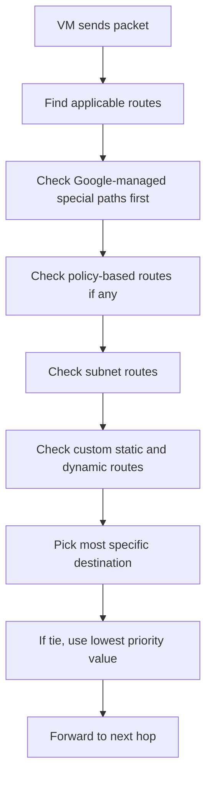
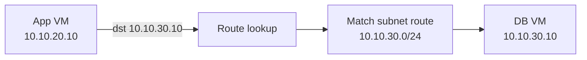
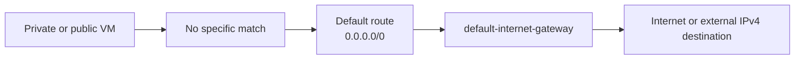
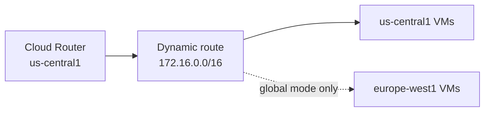
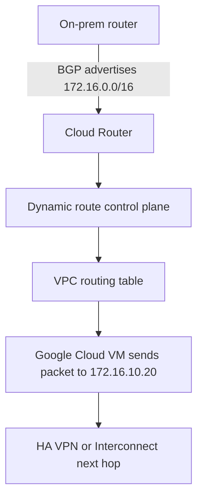
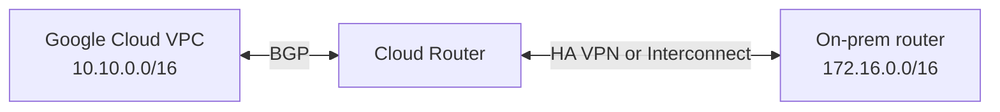

## Introduction to routing

Routing is the decision process that tells a packet where to go next.

In Google Cloud, every packet leaving a VM is matched against a routing table for its VPC network. Google Cloud then picks the best route and forwards the packet to that route's next hop.

That sounds simple, but there are a few Google Cloud details that matter immediately:

- A VPC uses a **distributed virtual routing system**, not a single physical router.
- The routing table is defined at the **VPC level**, but each VM only uses the routes that are **applicable** to it.
- Some routes are created automatically by Google Cloud.
- Some routes are created by you.
- Some routes are created dynamically by **Cloud Router** through BGP.

This tutorial uses a small mental model:

| Environment | Region | CIDR | Role |
| --- | --- | --- | --- |
| `prod-web` | `us-central1` | `10.10.10.0/24` | Public web tier |
| `prod-app` | `us-central1` | `10.10.20.0/24` | Internal app tier |
| `prod-db` | `us-central1` | `10.10.30.0/24` | Private database tier |
| `onprem-hq` | On-prem | `172.16.0.0/16` | Corporate data center |

The goal is to answer questions like:

- How does a VM reach another subnet?
- How does a private VM reach the internet?
- How does Google Cloud know to send on-prem traffic over VPN?
- What changes when you move from static routes to BGP-based routing?

## How packets move inside GCP

When a VM sends a packet, Google Cloud does not ask a central hardware router for help. Instead, Google Cloud's distributed control plane keeps each VM informed about the routes that apply to it. For each packet, Google Cloud selects the best matching route and forwards the traffic to that route's next hop.

The packet flow looks like this:



For advanced beginners, the practical version is:

1. Google Cloud looks for the most specific route that matches the destination IP.
2. If multiple routes have the same prefix length, the route with the **lowest priority number** wins.
3. If nothing more specific matches, the default route can be used.

### Packet flow example: app VM to database VM

Assume:

- App VM: `10.10.20.10`
- DB VM: `10.10.30.10`
- DB subnet: `10.10.30.0/24`

Packet flow:

1. The app VM sends a packet to `10.10.30.10`.
2. Google Cloud sees that `10.10.30.0/24` is a subnet route in the same VPC.
3. That subnet route is more specific than the default route `0.0.0.0/0`.
4. The packet stays inside the VPC and is delivered to the DB VM's subnet.



### Packet flow example: private VM to the internet through Cloud NAT

Assume:

- VM has only a private IP
- Default route `0.0.0.0/0` exists
- Cloud NAT is configured for the subnet

Flow:

1. VM sends traffic to `8.8.8.8`.
2. No subnet route matches that internet destination.
3. The default internet route `0.0.0.0/0` is selected.
4. Cloud NAT translates the source IP and sends the traffic out.

Important nuance: **Cloud NAT depends on the default internet route for its egress path**. Cloud Router helps Cloud NAT as a control-plane component, but Cloud Router is not doing BGP for Cloud NAT.

### Packet flow example: app VM to on-prem

Assume:

- On-prem CIDR: `172.16.0.0/16`
- HA VPN and Cloud Router are configured
- Cloud Router learned `172.16.0.0/16` over BGP

Flow:

1. App VM sends a packet to `172.16.10.20`.
2. Google Cloud finds the learned dynamic route for `172.16.0.0/16`.
3. The next hop is the HA VPN tunnel managed by Cloud Router.
4. The packet exits the VPC through the tunnel toward on-prem.

## System routes

Every new VPC comes with routes that Google Cloud creates for you. These are the first routes most engineers work with, even if they never notice them.

### 1. Subnet routes

Each subnet automatically creates a route for its IP ranges.

If you have these subnets:

- `10.10.10.0/24`
- `10.10.20.0/24`
- `10.10.30.0/24`

Then Google Cloud creates corresponding subnet routes automatically. You do not create these by hand, and you do not delete them unless you delete the subnet itself.

These routes are what let workloads in one subnet reach workloads in another subnet inside the same VPC.

| Subnet | Automatic route | Why it matters |
| --- | --- | --- |
| `prod-web` | `10.10.10.0/24` | Reaches web VMs |
| `prod-app` | `10.10.20.0/24` | Reaches app VMs |
| `prod-db` | `10.10.30.0/24` | Reaches database VMs |

### 2. Default internet route

When you create a VPC, Google Cloud also creates a system-generated IPv4 default route:

- Destination: `0.0.0.0/0`
- Next hop: `default-internet-gateway`

This route is only used when no more specific route matches.

That default route enables:

- VMs with external IPs to reach external IPv4 destinations
- Cloud NAT-based egress for private VMs
- Some paths to Google APIs when you use internet-gateway-based routing instead of Private Service Connect



### 3. Special routing paths

Google Cloud also has some **special routing paths** for products like certain load balancers and forwarding rules. These paths do not appear like normal VPC routes in the route table.

For this tutorial, the key lesson is:

- **Normal east-west traffic** usually relies on subnet, static, or dynamic routes.
- Some managed products use **Google-managed routing paths** behind the scenes.

### Route selection fundamentals

For normal routing decisions, remember this order:

- More specific prefixes beat broader prefixes.
- Subnet routes are preferred over broader custom routes.
- If prefix length ties, the route with the lower priority wins.

Example:

| Route | Prefix | Priority | Winner for `10.10.30.10` |
| --- | --- | --- | --- |
| `10.10.30.0/24` subnet route | `/24` | N/A | Wins |
| `10.10.0.0/16` custom route | `/16` | `900` | Loses because it is broader |
| `0.0.0.0/0` default route | `/0` | `1000` | Loses because it is much broader |

## Custom routes

Custom routes are the routes you add on top of the system-generated baseline.

In Google Cloud, the most common custom route type for beginners is the **static route**. A static route has:

- one destination CIDR
- one next hop
- an optional priority
- optional network tag targeting

Common next hop types include:

| Next hop type | Good use case |
| --- | --- |
| `default-internet-gateway` | Explicit internet or Google API egress path |
| Next-hop instance | Third-party appliance or custom router VM |
| Next-hop IP | Direct traffic to an appliance IP |
| VPN tunnel | Static routing over Classic VPN |
| Internal passthrough load balancer | Centralized inspection or service insertion |

### Static route example: force Google API traffic to a specific path

Suppose your VMs need to reach `private.googleapis.com` through the default internet gateway, but you do not want to rely only on the broad `0.0.0.0/0` path.

You can create a more specific route:

```hcl
resource "google_compute_route" "private_google_apis" {
  name             = "prod-private-google-apis-route"
  network          = google_compute_network.prod.name
  dest_range       = "199.36.153.8/30"
  next_hop_gateway = "default-internet-gateway"
  priority         = 900
  description      = "Route private.googleapis.com traffic through the default internet gateway"
}
```

That route beats the general default route because `/30` is more specific than `/0`.

### Static route example: send branch traffic to a router appliance

```hcl
resource "google_compute_route" "branch_office_via_appliance" {
  name            = "prod-branch-office-via-appliance"
  network         = google_compute_network.prod.name
  dest_range      = "172.20.0.0/16"
  next_hop_ip     = "10.10.20.5"
  priority        = 800
  tags            = ["app-egress"]
  description     = "Send branch office traffic through the inspection appliance"
}
```

This is useful when:

- you run a firewall appliance
- you need traffic inspection
- you want only VMs with a certain tag to use that route

Production warning: if you use a next-hop instance or appliance path, that appliance must be designed for forwarding. Do not treat it like a regular VM.

### Static route example: on-prem path with a VPN tunnel

For static-routing-based VPN designs, the next hop can be a VPN tunnel:

```hcl
resource "google_compute_route" "onprem_static_vpn" {
  name                = "prod-onprem-static-vpn-route"
  network             = google_compute_network.prod.name
  dest_range          = "172.16.0.0/16"
  next_hop_vpn_tunnel = google_compute_vpn_tunnel.onprem_static.name
  priority            = 700
  description         = "Static route from VPC to on-prem over Classic VPN"
}
```

This works, but once your hybrid environment grows, static routes become harder to maintain than BGP-learned dynamic routes.

## Dynamic routing with Cloud Router

Cloud Router is Google Cloud's managed BGP control-plane service for dynamic routing.

The important beginner fact is this:

- **Cloud Router manages BGP sessions and route exchange**
- **Cloud Router does not forward packets itself**

Google's VPC data plane forwards the traffic. Cloud Router controls which dynamic routes get created in the VPC.

### What BGP does in plain language

BGP, or Border Gateway Protocol, is the routing protocol routers use to exchange reachability information.

In practical terms:

- your on-prem router says "I can reach `172.16.0.0/16`"
- Cloud Router says "I can advertise `10.10.0.0/16`"
- both sides learn prefixes dynamically instead of you typing static routes by hand

Basic BGP concepts:

| Term | Plain-English meaning |
| --- | --- |
| ASN | The identity number of a routing domain |
| Prefix | A CIDR block like `172.16.0.0/16` |
| Advertise | Tell a peer "I can reach this range" |
| Learn | Accept a route from a peer |
| Peer | The other router in the BGP session |

### Regional vs global dynamic routing

A VPC network can use one of two dynamic routing modes:

| Mode | Behavior |
| --- | --- |
| Regional | Dynamic routes are usable only in the region associated with their next hop |
| Global | Dynamic route control planes share best paths across regions, so dynamic routes can be created in all regions |

Use this rule of thumb:

- **Regional** is safer and simpler for single-region or tightly scoped environments.
- **Global** is usually better for multi-region hybrid designs where workloads in multiple regions must reach the same on-prem prefixes.



### Cloud Router packet flow



### Terraform example: Cloud Router for hybrid routing

The example below shows a basic Cloud Router plus one interface and one BGP peer. The HA VPN tunnel is assumed to exist already.

```hcl
terraform {
  required_version = ">= 1.7.0"

  required_providers {
    google = {
      source  = "hashicorp/google"
      version = "~> 7.0"
    }
  }
}

provider "google" {
  project = var.project_id
  region  = "us-central1"
}

resource "google_compute_network" "prod" {
  name                    = "prod-core-vpc"
  auto_create_subnetworks = false
  routing_mode            = "GLOBAL"
}

resource "google_compute_subnetwork" "app" {
  name          = "prod-us-central1-app-snet"
  ip_cidr_range = "10.10.20.0/24"
  region        = "us-central1"
  network       = google_compute_network.prod.id
}

resource "google_compute_router" "hybrid" {
  name    = "prod-hybrid-cr"
  region  = "us-central1"
  network = google_compute_network.prod.id

  bgp {
    asn               = 64514
    advertise_mode    = "CUSTOM"
    advertised_groups = ["ALL_SUBNETS"]

    advertised_ip_ranges {
      range       = "10.200.0.0/16"
      description = "Shared services range"
    }
  }
}

resource "google_compute_router_interface" "ha_vpn_if1" {
  name       = "prod-hybrid-if1"
  router     = google_compute_router.hybrid.name
  region     = google_compute_router.hybrid.region
  ip_range   = "169.254.10.1/30"
  vpn_tunnel = google_compute_vpn_tunnel.onprem_ha_vpn.name
}

resource "google_compute_router_peer" "onprem" {
  name                      = "prod-onprem-peer"
  router                    = google_compute_router.hybrid.name
  region                    = google_compute_router.hybrid.region
  interface                 = google_compute_router_interface.ha_vpn_if1.name
  peer_ip_address           = "169.254.10.2"
  peer_asn                  = 65010
  advertised_route_priority = 100
}

variable "project_id" {
  type = string
}
```

What this configuration does:

- creates a VPC with `GLOBAL` dynamic routing mode
- creates a Cloud Router with ASN `64514`
- advertises all local subnets plus one extra custom range
- builds a BGP session to an on-prem peer ASN `65010`

## Hybrid networking basics

Hybrid networking means connecting Google Cloud to networks outside Google Cloud, usually:

- on-prem data centers
- branch offices
- another cloud

The two most common patterns are:

| Pattern | Route management style | Good for |
| --- | --- | --- |
| Static VPN | Manually maintained routes | Small and simple networks |
| HA VPN or Interconnect with Cloud Router | Dynamic BGP-learned routes | Growing or production environments |

### Static hybrid example

You have one on-prem CIDR: `172.16.0.0/16`.

With static routing, you create:

- a route in Google Cloud pointing `172.16.0.0/16` to the VPN tunnel
- a route on-prem pointing `10.10.0.0/16` back to Google Cloud

This is easy at first, but becomes fragile if:

- on-prem adds more prefixes
- Google Cloud adds more VPC regions or subnets
- failover paths change

### Dynamic hybrid example

With HA VPN and Cloud Router:

- on-prem advertises `172.16.0.0/16`
- Google Cloud advertises `10.10.0.0/16`
- if a prefix changes, BGP updates the routing automatically



### Why dynamic routing usually wins in production

- Less manual route drift
- Easier failover handling
- Better fit for multi-prefix environments
- Cleaner multi-region expansion

### When regional mode causes surprises

Imagine:

- Cloud Router is in `us-central1`
- VPC dynamic routing mode is `REGIONAL`
- App workloads also run in `europe-west1`

Result:

- `us-central1` workloads can use the learned on-prem route
- `europe-west1` workloads might not get that dynamic route

That is one of the most common beginner mistakes in hybrid GCP design. The route exists, but not where you expected.

## Troubleshooting routing issues

Routing problems often look like firewall problems at first, so keep the checks ordered.

Start with this sequence:

1. Confirm the destination IP.
2. Confirm the source VM region and subnet.
3. Check which route should match.
4. Compare prefix length and route priority.
5. Confirm the next hop is healthy.
6. For hybrid paths, check Cloud Router and BGP session health.
7. Only after that, check firewall rules.

### Common routing failure patterns

| Symptom | Likely cause | What to inspect |
| --- | --- | --- |
| VM cannot reach internet | Default route missing or broken egress design | `0.0.0.0/0`, Cloud NAT, external IP path |
| VM cannot reach on-prem | Missing static route or BGP-learned route | Route table, VPN or Interconnect state, Cloud Router peer |
| One region can reach on-prem, another cannot | Regional dynamic routing mode | VPC routing mode and Cloud Router region |
| Traffic takes wrong path | More specific route or lower-priority route wins | Prefix lengths and priorities |
| Route exists but traffic still fails | Firewall or appliance forwarding issue | Firewall rules, IP forwarding, next-hop health |

### Practical checks

Useful commands:

```bash
gcloud compute routes list --filter='network=prod-core-vpc'
gcloud compute routes describe prod-onprem-static-vpn-route
gcloud compute routers describe prod-hybrid-cr --region=us-central1
gcloud compute routers get-status prod-hybrid-cr --region=us-central1
```

What you are looking for:

- is the route present?
- is the destination prefix correct?
- is the next hop what you expected?
- are BGP sessions up?
- did the route land in the expected region?

Production tip: route propagation is eventually consistent. If you just changed a route or BGP session, give Google Cloud a moment before assuming the platform ignored your change.

## Production recommendations

Treat routing as architecture, not just configuration.

### Recommended defaults

| Topic | Recommendation |
| --- | --- |
| VPC design | Use custom-mode VPCs with documented CIDR plans |
| Static routes | Use them for narrow, intentional cases |
| Hybrid routing | Prefer HA VPN or Interconnect with Cloud Router |
| Dynamic routing mode | Use regional for simple single-region estates, global for multi-region hybrid designs |
| Priorities | Leave numeric gaps such as `700`, `800`, `900`, `1000` |
| Observability | Review route tables and Cloud Router status during changes |

### Design advice that ages well

- Keep route intent obvious in naming, such as `prod-onprem-static-vpn-route`.
- Avoid overlapping CIDRs between GCP, on-prem, and peered networks.
- Do not send broad `10.0.0.0/8` traffic to a hybrid next hop unless you truly mean it.
- Prefer dynamic routing when multiple teams or environments will evolve the network over time.
- Use global dynamic routing mode only when you actually need cross-region route propagation.
- Remember that Cloud Router is a **control-plane** component, not a packet-forwarding device.

## FAQ

**What is the difference between a subnet route and a custom route?**  
A subnet route is created automatically for a subnet's IP ranges. A custom route is something you define yourself, such as a static route to a VPN tunnel or router appliance.

**Does Cloud Router forward packets?**  
No. Cloud Router manages BGP sessions and dynamic route exchange. Google Cloud's VPC data plane forwards the packets.

**What is the default internet route in Google Cloud?**  
It is the system-generated route to `0.0.0.0/0` with next hop `default-internet-gateway`.

**What wins: a more specific route or a lower priority route?**  
The more specific destination wins first. Priority only breaks ties between routes with the same prefix length.

**When should I use static routing instead of Cloud Router?**  
Use static routing for small, stable environments with very few prefixes. Use Cloud Router when the topology is expected to grow or change.

**What does global dynamic routing mode actually change?**  
It lets dynamic route control planes share best paths across regions so learned dynamic routes can be created in all VPC regions, not just the region of the Cloud Router next hop.

**Is Cloud NAT the same thing as Cloud Router?**  
No. Cloud NAT uses Cloud Router for control-plane capabilities, but Cloud NAT is not a BGP peering feature.
