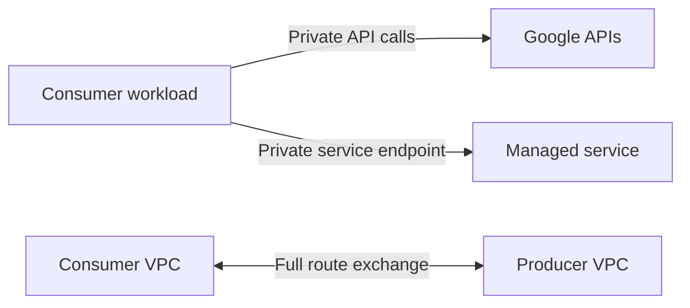
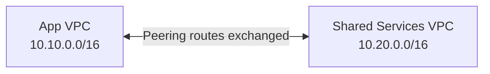
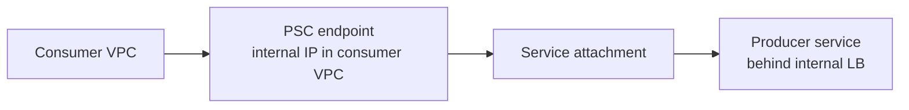
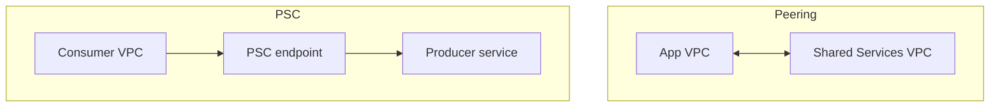

## Why private connectivity matters

Not every private connection problem in Google Cloud is the same.

Sometimes you want:

- one VPC to reach another VPC as if they were directly connected networks
- one application to consume one managed service privately without exposing the producer's whole network
- private VMs to call Google APIs without public IPs
- Cloud SQL or other Google-managed services to use private IPs inside your address plan

Those are four related but different problems. Google Cloud offers different products because the security and operational tradeoffs are different.

At a high level:

| Need | Best first candidate |
| --- | --- |
| Full network-to-network connectivity between two VPCs | VPC Peering |
| Private, service-oriented access to a specific service | Private Service Connect |
| Private VMs reaching Google APIs and services | Private Google Access |
| Private IP connectivity to certain Google-managed or third-party VPC-hosted services | Private services access via Service Networking |

The mistake many teams make is choosing the first private-looking feature they see and trying to use it for everything.



This tutorial focuses on the architectural question most teams hit next: **When should you use VPC Peering, and when should you use Private Service Connect?**

## VPC peering

VPC Network Peering connects two VPC networks so resources in each can communicate using internal IP connectivity.

The key design idea is simple:

- it is **network-to-network**
- it exchanges routes
- it does **not** merge administrative ownership

That means the two VPCs stay separate, but packets can move between them if routes and firewalls allow it.

### What VPC peering is good at

VPC Peering is usually a strong choice when:

- two internal platforms need direct RFC1918 connectivity
- two teams in the same company need low-latency east-west communication
- a shared services VPC exposes many internal resources, not one single service
- you want internal IP reachability for VMs, GKE, or internal load balancers across VPCs

### Peering mental model



### Peering characteristics

| Characteristic | What it means in practice |
| --- | --- |
| Bidirectional network connectivity | Both VPCs can reach each other if routes and firewalls allow it |
| Non-transitive | If `A` is peered with `B`, and `B` with `C`, that does not make `A` reach `C` |
| Overlap not allowed | Subnet ranges across peered VPCs cannot overlap |
| Administrative separation | Firewall rules and policies are not shared automatically |
| Route exchange controls | Subnet routes are exchanged; custom route exchange is optional and limited by configuration |

### Security reality

Peering is powerful, but it is broad. When you peer two VPCs, you are exposing network reachability between networks, not publishing one carefully bounded service.

That can be the right answer for:

- shared observability VPCs
- private DNS or package mirror environments
- tightly governed internal platform networks

But it can be the wrong answer when the real goal is only:

- expose one database endpoint
- expose one internal API
- publish one managed producer service to consumers in other projects

### Terraform example

```hcl
terraform {
  required_version = ">= 1.7.0"

  required_providers {
    google = {
      source  = "hashicorp/google"
      version = "~> 7.0"
    }
  }
}

resource "google_compute_network" "app" {
  name                    = "app-vpc"
  auto_create_subnetworks = false
}

resource "google_compute_network" "shared" {
  name                    = "shared-services-vpc"
  auto_create_subnetworks = false
}

resource "google_compute_network_peering" "app_to_shared" {
  name         = "app-to-shared"
  network      = google_compute_network.app.self_link
  peer_network = google_compute_network.shared.self_link
}

resource "google_compute_network_peering" "shared_to_app" {
  name         = "shared-to-app"
  network      = google_compute_network.shared.self_link
  peer_network = google_compute_network.app.self_link
}

resource "google_compute_network_peering_routes_config" "app_routes" {
  peering = google_compute_network_peering.app_to_shared.name
  network = google_compute_network.app.name

  import_custom_routes = true
  export_custom_routes = true
}

resource "google_compute_network_peering_routes_config" "shared_routes" {
  peering = google_compute_network_peering.shared_to_app.name
  network = google_compute_network.shared.name

  import_custom_routes = true
  export_custom_routes = true
}
```

Production note: only enable custom route exchange when you actually need it. Blindly importing and exporting everything can widen blast radius fast.

## Private Service Connect

Private Service Connect, usually shortened to **PSC**, is a service-oriented private connectivity model.

Instead of connecting whole networks, PSC lets a **consumer** connect privately to a **specific service** offered by a **producer**.

The core design pattern is:

- consumer owns an endpoint inside its VPC
- producer owns the service implementation
- the consumer reaches the service privately without getting access to the producer's whole VPC

### Producer and consumer model

| Role | What it owns |
| --- | --- |
| Producer | The published service, usually behind a supported load balancer or Google-managed service attachment model |
| Consumer | The private endpoint or backend used to reach that service |

### PSC mental model



This is the big difference from peering:

- **Peering** exposes route-based network reachability between VPCs.
- **PSC** exposes only the specific service path the producer publishes.

### What PSC is good at

PSC is usually the better design when:

- you are consuming an internal API from another team
- a platform team publishes a shared service to many app teams
- a SaaS provider publishes a service privately into customer VPCs
- you want access to Google APIs using internal endpoints in your VPC

### Why PSC scales well organizationally

Private Service Connect has three traits that make it attractive in cloud-native platforms:

- service-oriented access instead of broad network reachability
- explicit authorization between producer and consumer
- no IP coordination requirement between producer and consumer because PSC uses NAT between them

That last point matters a lot. With PSC, producer and consumer networks do not need the same kind of coordinated non-overlapping address planning that peering requires.

### PSC for Google APIs

PSC is not only for user-managed producer services. It can also create private access to **Google APIs**.

That gives you a pattern where:

- workloads use internal endpoints
- traffic stays on Google's network
- you do not need to expose workloads to the public internet

### PSC Terraform example

The most practical consumer-side example is a PSC endpoint that connects to a service attachment published by another team or provider.

```hcl
terraform {
  required_version = ">= 1.7.0"

  required_providers {
    google = {
      source  = "hashicorp/google"
      version = "~> 7.0"
    }
  }
}

resource "google_compute_network" "consumer" {
  name                    = "consumer-vpc"
  auto_create_subnetworks = false
}

resource "google_compute_subnetwork" "consumer" {
  name          = "consumer-us-central1-snet"
  ip_cidr_range = "10.30.0.0/24"
  region        = "us-central1"
  network       = google_compute_network.consumer.id
}

resource "google_compute_address" "psc_endpoint_ip" {
  name         = "orders-psc-endpoint-ip"
  region       = "us-central1"
  subnetwork   = google_compute_subnetwork.consumer.id
  address_type = "INTERNAL"
}

resource "google_compute_forwarding_rule" "orders_psc_endpoint" {
  name                  = "orders-psc-endpoint"
  region                = "us-central1"
  network               = google_compute_network.consumer.name
  subnetwork            = google_compute_subnetwork.consumer.name
  ip_address            = google_compute_address.psc_endpoint_ip.id
  target                = "projects/producer-project/regions/us-central1/serviceAttachments/orders-service-attachment"
  load_balancing_scheme = ""
}
```

This example is intentionally consumer-focused because that is how many platform teams adopt PSC first: one team publishes a service, many teams consume it.

### Producer-side intuition

On the producer side, PSC usually means:

1. deploy the service behind a supported internal load balancer or other supported producer target
2. create a service attachment
3. authorize consumers explicitly

That makes PSC a strong model for internal platform APIs, managed database access layers, and private SaaS consumption patterns.

## Architecture comparisons

The cleanest comparison is network-oriented versus service-oriented.

| Question | VPC Peering | Private Service Connect |
| --- | --- | --- |
| Primary model | Network-to-network | Service-to-service |
| Route exchange | Yes | No general route exchange |
| Transitive | No | Not relevant in the same way; service access is explicit |
| Overlapping CIDRs | Not allowed | Easier to tolerate because producer/consumer do not need broad routed overlap coordination |
| Exposure scope | Potentially broad network reachability | Narrow service endpoint reachability |
| Common fit | Shared services VPC, internal platform networking | Internal APIs, private SaaS, Google APIs |

### Visual comparison



### Where Private Google Access fits

Private Google Access is different from both PSC and peering.

Private Google Access is a **subnet-level capability** that lets VMs with only internal IPs reach the external IP addresses of Google APIs and services.

It is the right mental model when the question is:

- "My private VM needs to call Google APIs, but it has no external IP."

It is **not** the right mental model when the question is:

- "I need one VPC to reach another VPC."
- "I want to publish one internal service to many consumers."

### Where Service Networking fits

Service Networking, commonly discussed through **private services access**, is yet another different pattern.

Private services access is used for certain Google-managed and third-party VPC-hosted services and creates a private connection by using:

- an allocated private range
- a Service Networking connection
- an underlying VPC Network Peering connection to the producer network

That means:

- private services access is not the same thing as PSC
- private services access is not generic VPC peering that you manage directly

This often shows up in real life with services such as Cloud SQL or AlloyDB private IP designs.

### Service Networking Terraform example

```hcl
resource "google_compute_network" "service_consumer" {
  name                    = "service-consumer-vpc"
  auto_create_subnetworks = false
}

resource "google_compute_global_address" "private_services_range" {
  name          = "google-managed-services-range"
  purpose       = "VPC_PEERING"
  address_type  = "INTERNAL"
  prefix_length = 16
  network       = google_compute_network.service_consumer.id
}

resource "google_service_networking_connection" "private_services_access" {
  network                 = google_compute_network.service_consumer.id
  service                 = "servicenetworking.googleapis.com"
  reserved_peering_ranges = [google_compute_global_address.private_services_range.name]
}
```

Use this when the service explicitly requires private services access. Do not substitute PSC just because it sounds newer.

## Security implications

Private connectivity is not automatically least-privilege connectivity.

### VPC peering security shape

Peering increases network reachability between two VPCs. That can be fine, but it means your security model must account for:

- larger route visibility
- firewall rule design on both sides
- accidental future expansion of reachable resources

Peering does **not** exchange firewall rules or firewall policies. Each side still controls its own firewall behavior.

### PSC security shape

PSC is usually easier to align with least privilege because:

- consumers reach a specific service, not a whole peer network
- producers can authorize exactly who can connect
- network overlap coordination is reduced

This makes PSC attractive for multi-team enterprises where producers do not want consumers to see anything except one published service.

### Security comparison

| Topic | VPC Peering | PSC |
| --- | --- | --- |
| Blast radius if mis-scoped | Larger | Smaller |
| Producer control over access scope | Lower | Higher |
| Network-level trust required | More | Less |
| Fit for multi-tenant internal platform | Mixed | Strong |

### Private Google Access security shape

Private Google Access is operationally safer than handing every VM a public IP, but it is not a generalized service-publishing feature. It is best understood as:

- private egress to Google APIs and services
- not private connectivity to arbitrary producer VPC services

### Practical security rule

If your true requirement is "let this client call exactly this service," default toward PSC first.  
If your true requirement is "these two networks should functionally communicate across many resources," evaluate peering.

## Production use cases

### 1. Shared observability VPC

A platform team runs:

- package mirrors
- logging collectors
- internal registries
- security scanners

for many internal application teams.

If application teams need broad internal IP reachability to several of those resources, **VPC Peering** can make sense.

### 2. Internal platform API

A central team exposes:

- feature flag service
- internal identity broker
- policy engine

to dozens of app teams.

This is often a better **PSC** fit because each consumer only needs a narrow service endpoint, not access to the platform team's whole VPC.

### 3. Private access to Google APIs from private workloads

A data processing VM with no external IP needs:

- Cloud Storage
- Secret Manager
- Artifact Registry

If the requirement is just API access from private VMs, start with **Private Google Access** or PSC for Google APIs based on the service and control model you need, not peering.

### 4. Private IP Cloud SQL pattern

A private application needs Cloud SQL using internal addresses.

This often leads to **private services access via Service Networking**, because the service is implemented as a producer VPC-hosted managed service pattern.

### 5. Private SaaS consumption

A third-party provider publishes a service privately into customer VPCs.

This is one of the clearest **PSC** use cases:

- provider stays isolated
- customer gets an internal endpoint
- no full VPC-to-VPC trust relationship is needed

## Common mistakes

- Using VPC Peering when only one service needs to be published privately.
- Expecting VPC Peering to be transitive across multiple hub-and-spoke peers.
- Forgetting that overlapping subnet ranges block peering.
- Assuming PSC gives full network-to-network connectivity. It does not.
- Treating Private Google Access as if it were a generic private connectivity feature for all producer services.
- Confusing private services access with PSC. They solve different service connectivity models.
- Choosing a service connectivity pattern without checking what the target managed service actually supports.
- Turning on peering custom route exchange everywhere without understanding the route blast radius.

## FAQ

**What is the simplest difference between PSC and VPC Peering?**  
VPC Peering connects networks. Private Service Connect connects consumers to specific services.

**When should I prefer PSC?**  
Prefer PSC when you want least-privilege private access to one service, especially across teams, projects, or organizations.

**When should I prefer VPC Peering?**  
Prefer peering when two VPCs need broader internal IP connectivity across multiple resources and you can handle non-overlapping CIDRs and non-transitive routing.

**Is Private Google Access the same as PSC?**  
No. Private Google Access lets private VMs reach Google APIs and services through subnet configuration and routing requirements. PSC is a service endpoint model.

**Is private services access the same as peering?**  
It uses an underlying VPC Network Peering connection to the service producer, but it is a specific managed-service connectivity pattern, not generic peering that you design and use freely between application VPCs.

**Can PSC replace peering in every case?**  
No. PSC is excellent for private service publishing and consumption. It is not a general substitute for broad routed connectivity between two networks.

**Can peering be used across organizations?**  
Yes. VPC Peering can connect VPCs in different organizations, but the route, firewall, and trust implications still need careful review.

**What should I choose for Cloud SQL private IP?**  
Choose the connectivity model that the service supports. For Cloud SQL private IP, that commonly means private services access rather than generic peering or a user-managed PSC pattern.
