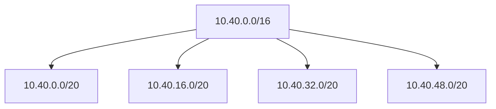
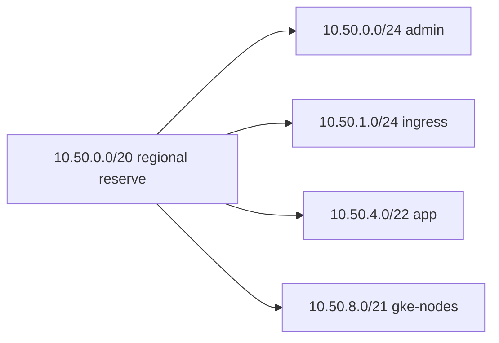
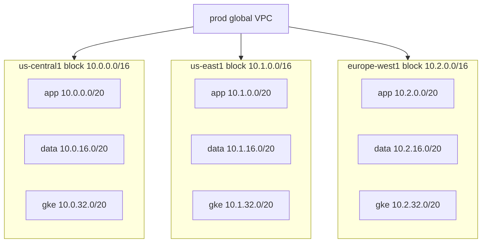
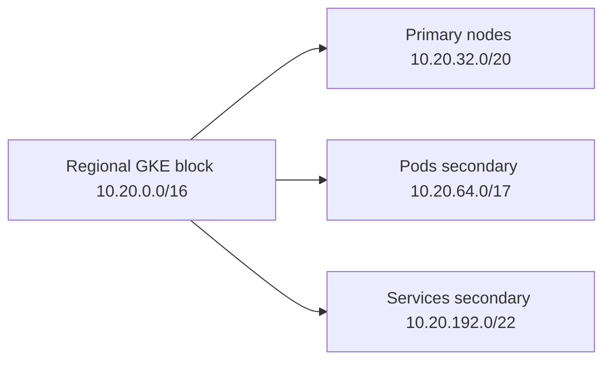
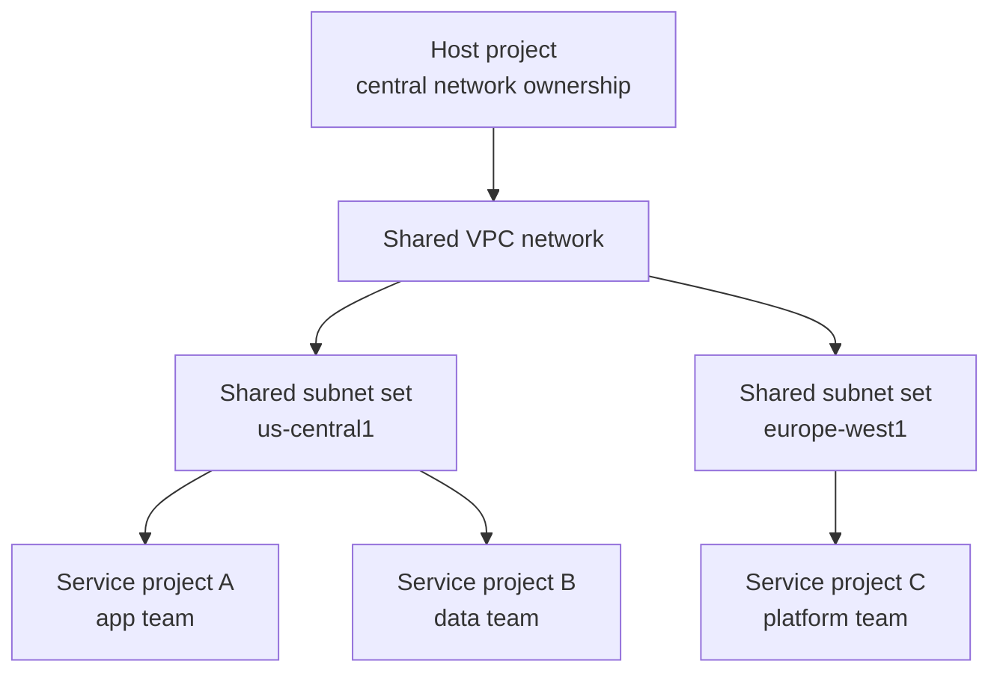

## What is CIDR

CIDR stands for **Classless Inter-Domain Routing**. It is the notation you use to describe an IP network and its prefix length, such as `10.20.30.0/24`.

The part before the slash is the network address. The part after the slash is the number of bits reserved for the network. The remaining bits are available for hosts or sub-allocation.

In practical cloud networking, CIDR answers three questions:

- How big is this subnet?
- Which IPs belong to it?
- How much room do I have left before I need another subnet?

| CIDR | Total IPv4 addresses | Typical generic usable hosts | Google Cloud primary subnet usable IPs |
| --- | --- | --- | --- |
| `/28` | 16 | 14 | 12 |
| `/27` | 32 | 30 | 28 |
| `/24` | 256 | 254 | 252 |
| `/20` | 4,096 | 4,094 | 4,092 |
| `/16` | 65,536 | 65,534 | 65,532 |

In Google Cloud, a primary subnet range loses **four** addresses, not two. Google reserves the first two and last two IPs in each primary IPv4 subnet range. That matters when you are doing tight capacity planning for node pools, bastion subnets, and small management networks.

| Example network | Meaning | Fast mental model |
| --- | --- | --- |
| `10.0.0.0/8` | Very large address pool | Good for carving environments |
| `10.10.0.0/16` | Regional or platform block | Good for one environment in one region |
| `10.10.32.0/20` | Workload block | Good for app, data, or node tiers |
| `10.10.32.0/24` | Small subnet | Good for admin, bastion, or tiny services |

## Private IP ranges

For most production Google Cloud environments, your default choice should be **RFC1918 private space**. These ranges are non-routable on the public internet and are the safest default when you expect VPN, Interconnect, peering, or hybrid growth.

| RFC | Range | Size | Common use |
| --- | --- | --- | --- |
| RFC1918 | `10.0.0.0/8` | 16,777,216 IPs | Large enterprises, multi-environment platforms |
| RFC1918 | `172.16.0.0/12` | 1,048,576 IPs | Mid-sized estates, segmented regional designs |
| RFC1918 | `192.168.0.0/16` | 65,536 IPs | Small environments, edge, labs |

Google Cloud documentation for VPC subnets lists these RFC1918 ranges as valid private IPv4 subnet ranges, and it also allows some additional internal ranges. Even so, RFC1918 should remain your production default unless you have a clear reason to use something else.

| Range family | Production guidance |
| --- | --- |
| RFC1918 private ranges | Preferred for almost every enterprise VPC design |
| `100.64.0.0/10` shared address space | Use only when you understand carrier-grade NAT overlaps and downstream implications |
| Privately used public IP space | Possible in GCP, but risky if you ever peer, import routes, or use BYOIP |

One practical rule keeps many teams out of trouble: **pick one RFC1918 strategy for the whole company**. If networking, platform, and Kubernetes teams all improvise independently, overlap becomes almost guaranteed.

| Org size | Safe default |
| --- | --- |
| Small startup | `10.0.0.0/8` reserved globally, even if you use only a small part today |
| Mid-sized company | `10.0.0.0/8` with environment and region blocks from day one |
| Hybrid enterprise | Audit on-prem first, then choose a private plan that avoids existing overlap |

## Understanding subnet masks

A subnet mask and a CIDR prefix describe the same boundary in two different formats. For example, `/24` is the same as `255.255.255.0`.

| CIDR | Subnet mask | Total IPs | GCP primary usable IPs | Typical role |
| --- | --- | --- | --- | --- |
| `/28` | `255.255.255.240` | 16 | 12 | Tiny management subnet |
| `/27` | `255.255.255.224` | 32 | 28 | Proxy or appliance subnet |
| `/26` | `255.255.255.192` | 64 | 60 | Small shared service tier |
| `/24` | `255.255.255.0` | 256 | 252 | Standard app subnet |
| `/23` | `255.255.254.0` | 512 | 508 | Denser application or node subnet |
| `/22` | `255.255.252.0` | 1,024 | 1,020 | Large regional shared tier |

CIDR math is easier if you remember one formula:

- Total IPs = `2^(32 - prefix)`
- GCP primary subnet usable IPs = `2^(32 - prefix) - 4`

| Example | Math | Result |
| --- | --- | --- |
| `10.40.0.0/24` | `2^(32-24) = 256` | 252 usable in GCP |
| `10.40.0.0/23` | `2^(32-23) = 512` | 508 usable in GCP |
| `10.40.16.0/20` | `2^(32-20) = 4096` | 4092 usable in GCP |

Visualizing the split helps:

If you cannot do the math quickly in your head, that is normal. The engineering requirement is not mental speed. It is **consistency**. You need a plan that teams can extend without guessing.

## Subnet sizing strategy

Subnet sizing is a capacity exercise, not a trivia exercise. Start from workload growth, not from a random `/24` habit.

| Workload pattern | Starting point | Why |
| --- | --- | --- |
| Bastion or admin subnet | `/27` or `/26` | Few instances, low growth |
| Small app tier | `/24` | Reasonable default, easy to understand |
| Large app tier or node pool | `/23` or `/22` | Prevent early fragmentation |
| Shared services or future-heavy region | `/20` | Leaves room for platform growth |
| GKE Pod secondary range | Often `/21` or larger | Pod IP demand grows faster than VM counts |

A production planner should always ask:

1. How many workloads exist today?
2. What is the 12 to 24 month growth target?
3. Will I add GKE, private services, PSC endpoints, or more regions later?
4. Does this subnet need room for blue-green or migration overlap?

| Prefix | Total IPs | GCP usable IPs | When it exhausts quickly |
| --- | --- | --- | --- |
| `/24` | 256 | 252 | Node pools, shared services, fast-growing app fleets |
| `/23` | 512 | 508 | Medium clusters with several pools |
| `/22` | 1,024 | 1,020 | Usually safer for regional shared tiers |
| `/20` | 4,096 | 4,092 | Better reserve block for structured subdivision |

**IP exhaustion** happens when the subnet still exists, but no new IPs can be allocated. In Google Cloud that blocks new VMs, forwarding rules, node scale-out, or load balancer growth depending on what uses the range.

| Exhaustion symptom | What usually caused it |
| --- | --- |
| New VM creation fails | Subnet sized too tightly for workload growth |
| GKE node pool stops scaling | Node primary range or Pod secondary range too small |
| Migration project stalls | No temporary overlap space for old and new systems |
| Shared services cannot expand | Many teams were pointed at one undersized subnet |

## Environment segmentation

The cleanest production estates separate **dev**, **staging**, and **prod** at the address-planning layer, not just with IAM and labels. If you do not reserve environment blocks early, teams eventually collide.

| Environment | Recommended property | Why |
| --- | --- | --- |
| Dev | Smaller, cheaper, disposable | Encourages experimentation without consuming prod-scale IPs |
| Staging | Close to prod shape | Makes capacity testing realistic |
| Prod | Largest reserved space | Production almost always grows faster than expected |
| Shared services | Separate from app environments | Avoids mixing DNS, logging, CI, and identity traffic with app subnets |

A straightforward enterprise pattern inside `10.0.0.0/8` is:

| Environment | Reserved block | Notes |
| --- | --- | --- |
| Prod | `10.0.0.0/10` | Largest block for long-term growth |
| Staging | `10.64.0.0/10` | Mirrors prod structure |
| Dev | `10.128.0.0/10` | Smaller per-workload needs, same pattern |
| Shared platform | `10.192.0.0/10` | Identity, CI, observability, transit, PSC |

Inside each environment, you can repeat the same region and subnet pattern:

| Prod regional block | Sub-allocation example |
| --- | --- |
| `10.0.0.0/16` for `us-central1` | `10.0.0.0/24` admin, `10.0.4.0/22` app, `10.0.16.0/20` GKE |
| `10.1.0.0/16` for `us-east1` | Same structure, different second octet |
| `10.2.0.0/16` for `europe-west1` | Same structure, easier operations |

This repeatable pattern lowers cognitive load. When an engineer sees `10.2.16.0/20`, they can infer both the environment and the region without opening a spreadsheet.

## Multi-region planning

Google Cloud VPC networks are global, but subnets are regional. That means your IP plan should reserve **regional blocks** inside an environment, then subdivide those blocks by workload.

| Planning layer | Example block | Purpose |
| --- | --- | --- |
| Environment | `10.0.0.0/10` | Prod |
| Region | `10.0.0.0/16` | Prod `us-central1` |
| Workload | `10.0.32.0/20` | Prod `us-central1` GKE nodes |
| Subnet | `10.0.48.0/24` | Prod `us-central1` admin subnet |

| Strategy | Benefit | Tradeoff |
| --- | --- | --- |
| One `/16` per region | Easy to reason about | Can feel wasteful in tiny environments |
| One `/20` per workload type in each region | Predictable growth path | Requires up-front discipline |
| Sparse allocation | Easy to insert future subnets | Uses more address space early |
| Dense allocation | Saves space today | Harder to expand later |

A common production mistake is to allocate subnets consecutively without reserving gaps. That feels efficient on day one and painful on year two.

| Better pattern | Worse pattern |
| --- | --- |
| Reserve a regional `/16`, then carve by role with gaps | Hand out random `/24`s as teams ask |
| Repeat the same subnet map in every region | Reinvent the plan in every region |
| Document future reserved ranges now | Promise to fix it later during migration |

## GKE subnet planning

Kubernetes changes IP planning because you are no longer sizing only for nodes. In a VPC-native GKE cluster, you must think about:

- The **primary subnet range** for nodes and internal load balancers
- A **secondary range** for Pods
- A **secondary range** for Services

Google Cloud guidance matters here:

- GKE Pod secondary ranges are immutable after cluster creation, so undersizing them causes future scaling pain.
- Google Cloud documentation notes that **all IPs in secondary ranges are usable for Pods**, while primary ranges still lose four addresses.
- For Standard clusters, the default maximum of **110 Pods per node** maps to a **/24** Pod CIDR per node.

| Range type | Example | Used for |
| --- | --- | --- |
| Primary subnet | `10.20.32.0/20` | Nodes, internal load balancers, node NICs |
| Pod secondary | `10.20.64.0/17` | Pod IPs |
| Service secondary | `10.20.192.0/22` | ClusterIP Services |

| Max Pods per node | Per-node Pod CIDR | IPs per node block | Good fit |
| --- | --- | --- | --- |
| 8 | `/28` | 16 | Very small clusters with many nodes |
| 32 | `/26` | 64 | Lower density, more node count flexibility |
| 64 | `/25` | 128 | Moderate density |
| 110 | `/24` | 256 | Standard default |
| 256 | `/23` | 512 | High density, consumes Pod space quickly |

The planning tradeoff is direct:

| Choice | What you gain | What you lose |
| --- | --- | --- |
| Higher Pods per node | Fewer nodes | Larger Pod CIDR per node |
| Lower Pods per node | More nodes in the same Pod range | Lower Pod density per node |
| Larger Pod secondary range | Scale headroom | More address space consumed |
| Smaller Pod secondary range | Conserves IPs | Higher risk of cluster exhaustion |

Practical example from Google Cloud sizing logic:

| Inputs | Result |
| --- | --- |
| Pod secondary range `/21`, max Pods per node `110` | Nodes get `/24` Pod blocks, so the cluster can support 8 nodes |
| Pod secondary range `/21`, max Pods per node `32` | Nodes get `/26` Pod blocks, so the cluster can support 32 nodes |

That is why a cluster can run out of Pod IPs even when the node subnet still has room. The node subnet and the Pod secondary range are different exhaustion domains.

## Common mistakes

The most expensive subnetting problems are usually not syntax mistakes. They are planning mistakes that surface only when you add regions, clusters, or hybrid links.

| Mistake | Why it hurts | Better move |
| --- | --- | --- |
| Starting every subnet as `/24` | Looks tidy, causes early exhaustion | Size by growth, not habit |
| Overlapping VPC and on-prem ranges | Breaks VPN, peering, and route import | Reserve a company-wide IP plan first |
| Not separating environments | Dev and prod become entangled operationally | Reserve environment blocks up front |
| Ignoring GKE secondary ranges | Cluster scales fail later | Plan node, Pod, and Service ranges separately |
| Letting every project choose its own CIDR | Shared VPC and peering get messy fast | Centralize address ownership |
| Filling a regional block densely | No room for future subnet insertion | Leave intentional gaps |

**Overlapping subnets** are especially painful. They create ambiguous routing and often block:

- Cloud VPN or Interconnect attachments
- VPC Network Peering
- Shared services migration
- Mergers between teams or projects
- Shared VPC adoption later

| Overlap scenario | Real-world consequence |
| --- | --- |
| On-prem and GCP both use `10.1.0.0/16` | Hybrid routing conflict |
| Two GCP VPCs both use `10.20.0.0/16` | Peering design becomes constrained or impossible |
| Service project already uses random RFC1918 space | Shared VPC migration requires re-addressing |
| GKE Pods overlap with future regional app ranges | Platform team has to redesign cluster networking under load |

IP exhaustion and overlap often combine. Teams squeeze small ranges to save space, then later reuse neighboring space without a central plan.

## Production recommendations

Production IP planning should be opinionated. Ambiguity is what turns networking into archaeology six months later.

| Recommendation | Reason |
| --- | --- |
| Reserve a company-wide RFC1918 strategy first | Prevent overlap across cloud, on-prem, labs, and partners |
| Allocate by environment, then by region, then by workload | Keeps growth predictable |
| Prefer sparse, documented allocation | Future subnet insertion is easier than re-addressing |
| Use larger regional reserve blocks than you need today | Cloud platforms expand faster than expected |
| Treat GKE as a separate planning track | Node, Pod, and Service ranges grow differently |
| Keep a source-of-truth spreadsheet or IaC-generated registry | Avoid tribal knowledge |
| Review plans before Shared VPC rollout | Shared VPC centralizes network control, so bad plans spread faster |

For **Shared VPC**, the strongest pattern is:

| Shared VPC element | Planning advice |
| --- | --- |
| Host project | Owns the canonical network plan and subnet lifecycle |
| Service projects | Consume selected subnets, not ad hoc CIDRs |
| Shared subnets | Grant at subnet level where possible, not whole-host-project by default |
| Secondary ranges | Reserve them in the host project early for GKE and platform services |

Google Cloud Shared VPC documentation emphasizes that the host project can share selected subnets, including secondary ranges, with service projects, and that subnet-level permissions help preserve least privilege. That should shape your IP plan: **design the host project like a platform, not like a single app team’s network**.

| Team maturity | Practical recommendation |
| --- | --- |
| Early-stage | Still reserve the whole `10.0.0.0/8` mentally, even if only one `/16` is active |
| Scaling startup | Standardize one reusable regional template |
| Enterprise platform | Review every new region and GKE cluster against the central CIDR registry |

## FAQ

| Question | Answer |
| --- | --- |
| Should I always use `10.0.0.0/8`? | Not always, but it is the safest large default if it does not conflict with existing networks. |
| Is `/24` still a good default subnet size? | For many small app tiers, yes. For node pools, shared services, and growth-heavy workloads, often no. |
| Why do Google Cloud primary subnets have fewer usable IPs than classic subnet math suggests? | Google Cloud reserves the first two and last two addresses in each primary IPv4 subnet range. |
| Can I resize a subnet later? | You can expand primary ranges in some cases, but you should not build a production plan that depends on rescue resizing. |
| Why do GKE clusters run out of IPs even when the subnet looks big? | Because Pod secondary ranges can exhaust independently from the primary node subnet. |
| Should dev and prod share a VPC? | Usually no. Separate environments reduce blast radius and make IP planning clearer. |
| How should I think about Shared VPC? | One team owns the network plan in the host project, while service projects consume approved subnets and secondary ranges. |
| What is the fastest way to detect future trouble? | Audit for small subnets, overlapping RFC1918 allocations, and GKE clusters with undersized Pod secondary ranges. |
